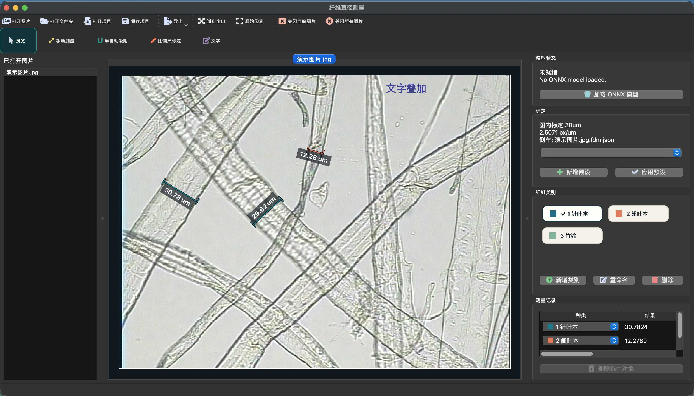

# Fiber Measurement / 纤维测量软件



离线纤维测量桌面软件，面向 Windows 10 / Windows 11 无独显电脑。当前版本已经覆盖纤维直径测量、纤维面积测量、实例分割面积自动识别、点提示魔棒分割、比例尺标定、项目保存，以及叠加图和表格数据导出。

## 功能概览

- 多图工作流
  - 同时打开多张图片，支持 `PNG / JPG / BMP / TIF / TIFF`
  - 支持打开文件夹中的全部图片，忽略子文件夹
  - 多图加载采用后台解码，并显示可取消的进度对话框
- 三栏工作区
  - 左侧：图片列表
  - 中间：多标签测量画布
  - 右侧：标定、模型、纤维类别、测量记录
- 双层工具区
  - 第一行：打开、保存、导出、视图、关闭图片等文件类操作
  - 第二行：`浏览`、`手动测量`、`半自动吸附`、`多边形面积`、`自由形状面积`、`魔棒分割`、`比例尺标定`、`文字`
- 测量模式
  - `浏览`：选择已有测量线并编辑端点
  - `手动测量`：直接绘制直径线
  - `半自动吸附`：第一次点击确定起点，第二次点击确定终点，再在局部 ROI 内吸附到纤维边界
  - `多边形面积`：逐点绘制闭环区域，点击首点或双击完成
  - `自由形状面积`：按住左键自由勾画区域，松开自动闭环
  - `魔棒分割`：通过正 / 负采样点交互式生成区域遮罩
  - `比例尺标定`：在图中拉取已知长度并输入实际距离
  - `文字`：添加任意说明文字，并在浏览模式拖动位置
- 面积识别
  - 支持实例分割模型自动识别面积结果
  - 支持当前图片或全部已打开图片批量识别
  - 自动识别结果会直接写入测量记录和类别
- 实时预览与预览分析
  - 支持采集设备实时预览
  - 支持在实时预览中启动 `景深合成`
  - `景深合成` 的“合成后锐化”默认开启
  - `地图构建` 入口当前保留在界面中，但默认不可用，并标注“开发中”
- 标定能力
  - 图内标定
  - 标定预设
  - 标定预设可通过“像素距离 + 实际距离 + 单位”自动计算比例尺
  - 标定自动写入图片同目录侧车文件 `<图片名>.fdm.json`
- 纤维类别
  - 支持未分类与多个编号类别
  - 支持新增、重命名、删除类别
  - `1-9` 数字键切换右侧当前激活类别
  - 新建测量会归入当前激活类别；旧测量不会因切换类别而改变
- 导出能力
  - 测量叠加图 PNG
  - 比例尺叠加图 PNG
  - 比例尺 JSON
  - `图片汇总.csv`
  - `纤维种类汇总.csv`
  - `测量明细.csv`
  - `纤维测量结果.xlsx`
  - 支持“叠加图 + Excel”快捷导出
- 图片导出渲染模式
  - `完整分辨率`：按原图分辨率导出精确标注
  - `整图按屏显比例导出`：更接近日常查看效果
  - `当前视窗截图`：保留当前画布视口构图
- 本地模型接入
  - 支持 ONNX Runtime CPU 本地推理
  - 未加载模型时自动回退到传统图像算法
  - `EdgeSAM` ONNX 已集成到项目运行时目录，用于魔棒分割
  - 面积自动识别使用独立 worker，在无独显 Windows 设备上走 CPU 推理
- 项目保存
  - `*.fdmproj` 保存图片路径、标定快照、类别、测量记录与视图状态
  - 文本标注、面积记录和手动比例尺位置都会保存到项目文件

## 交互与快捷键

- `空格`：临时抓手，按住后左键拖动画布
- 鼠标滚轮：缩放画布
- 鼠标中键拖动：平移画布
- `Shift`：绘制或拖拽时约束为水平或垂直
- `Ctrl`：端点吸附到像素中心
- `Shift + Ctrl`：同时启用方向约束和像素中心吸附
- `Delete / Backspace`：删除当前选中的测量
- `Ctrl + Z`：撤回当前图片中的编辑
- `Ctrl + Shift + Z`：重做当前图片中的编辑
- `A`：在当前工具与 `浏览` 工具之间切换
- `V`：切换面积填充显示 / 仅轮廓显示
- `1-9`：切换当前激活类别
- `R`：在魔棒分割的正采样点 / 负采样点之间循环切换
- `Enter / F`：完成当前魔棒遮罩
- `Esc`：放弃当前测量线、多边形、自由形状或魔棒草稿

说明：

- 数字键只用于切换右侧“纤维类别”的当前激活项，不会直接修改某条测量记录的类别。
- 测量记录表中的类别下拉需要显式点击展开后才会修改，滚轮经过不会误切换。
- 也可以通过菜单 `帮助 > 快捷键说明` 查看完整快捷键列表。

## 典型使用流程

1. 打开一张或多张显微图片，或直接打开包含图片的文件夹。
2. 使用 `比例尺标定` 完成图内标定，或在右侧创建并应用标定预设。
3. 在右侧创建或切换当前激活的纤维类别。
4. 根据场景选择 `手动测量`、`半自动吸附`、`多边形面积`、`自由形状面积` 或 `魔棒分割`。
5. 如果需要自动识别面积，可点击右侧 `面积自动识别...`。
6. 切换到 `浏览` 对线段端点、面积顶点、面积整体位置或文字位置做编辑。
7. 在右侧测量记录表中检查类别、类型、结果、模式、置信度和状态。
8. 通过 `保存项目` 保存完整会话，或通过导出菜单导出叠加图、比例尺文件、CSV、Excel。

## 半自动吸附说明

- 半自动吸附会在用户两次点击确定的近似测量线附近提取局部 ROI。
- 若已加载 ONNX 分割模型，则优先使用模型输出寻找纤维边界。
- 若模型不可用，则自动回退到阈值、形态学清理、连通域筛选等传统算法。
- 当前实现会尽量保持用户原始测量线角度，只对边界位置做吸附修正，避免自动旋转到不合适的方向。

## 实时预览分析说明

- `景深合成` 可在实时预览中持续采样，并在结束时生成更清晰的合成图像。
- `景深合成` 对话框中的“合成后锐化”默认开启，只影响最终导出结果，不影响实时预览过程中的画面。
- `地图构建` 按钮当前会显示在预览分析区域，但默认不可用，并在按钮附近标注“开发中”，用于提示该功能尚未开放。

## 面积测量与魔棒分割

- 面积记录和线段记录共用同一套类别、撤回 / 重做、项目保存和导出链路。
- `多边形面积` 支持点击首点闭环和双击自动闭环。
- `自由形状面积` 适合快速圈定不规则区域。
- `魔棒分割` 使用项目内置的 `EdgeSAM` ONNX 模型：
  - 左键添加当前类型的采样点
  - `R` 循环切换正采样点 / 负采样点
  - `Enter / F` 将当前预览遮罩固化为面积记录
  - `Esc` 放弃当前草稿
- 浏览模式下点击面积记录后，才会显示顶点和中心手柄；可拖中心整体移动，也可拖顶点改形状。

## 面积自动识别说明

- 面积自动识别使用本地实例分割 worker，不依赖 GPU。
- 运行前请确保设置中的模型名称与权重文件映射正确，且 `runtime/area-models` 中存在对应权重。
- 自动识别可以选择仅处理当前图片，或批量处理所有已打开图片。
- 重复执行同一张图的面积自动识别时，会替换该图旧的自动识别面积记录，但不会删除手绘面积或线段记录。

## 标定与项目文件

- 图内标定结果会自动写入图片同目录侧车文件：

```text
<image-name>.fdm.json
```

- 侧车文件只保存标定相关信息，不自动保存测量结果。
- 若希望保存完整测量会话，请使用项目文件：

```text
*.fdmproj
```

- 打开图片时会优先读取同名侧车中的标定信息；打开项目文件时，以项目中的标定快照和会话数据为准。

## 测量记录与类别

- 右侧“纤维类别”区域用于管理当前图片的类别集合和当前激活类别。
- 测量记录表默认列顺序为：
  - `种类`
  - `类型`
  - `结果`
  - `单位`
  - `模式`
  - `置信度`
  - `状态`
  - `ID`
- 表格中的“种类”列可以直接修改单条测量所属类别。
- 画布选中测量线后，右侧记录表会自动同步选中对应行；反向选择同样成立。

## ONNX 模型约定

- 目标任务：二分类分割，背景 / 纤维
- 推荐输入：单通道灰度图，或可转换为单通道的图像
- 支持的输出形态：
  - `[1, 1, H, W]`
  - `[1, H, W]`
  - `[H, W]`
- 预测值大于等于 `0.5` 时视为纤维掩码
- 推理后续逻辑会结合连通域筛选和几何求交完成最终边界定位

## 技术栈

- `Python 3.11+`
- `PySide6`：桌面界面
- `NumPy`：基础数值计算
- `OpenCV`：图像处理扩展依赖
- `ONNX Runtime CPU`：本地模型推理
- `pandas + openpyxl`：CSV / Excel 导出
- `qtawesome`：优先使用的工具栏图标库
  - 若当前环境未安装，界面会自动回退到内置线性图标

## 快速开始

### 1. 创建虚拟环境

macOS / Linux:

```bash
python -m venv .venv
source .venv/bin/activate
```

Windows PowerShell:

```powershell
python -m venv .venv
.venv\Scripts\Activate.ps1
```

### 2. 安装依赖

```bash
pip install -e .
```

如果你需要在开发环境中启用“面积自动识别”：

```bash
pip install -e .[area-infer]
```

### 3. 启动应用

```bash
python -m fdm
```

或：

```bash
fdm
```

## 测试

项目测试基于标准库 `unittest`。

```bash
python -m unittest discover -s tests
```

说明：

- 纯逻辑测试不依赖 GUI。
- GUI 相关测试位于 `tests/test_ui_canvas_and_export.py`，在安装了 `PySide6` 的环境中会运行；若环境缺少 `PySide6`，这些测试会自动跳过。
- GUI 测试默认使用 `QT_QPA_PLATFORM=offscreen`，适合在无桌面环境下做基础回归。

当前测试覆盖的重点包括：

- 标定换算与项目文件读写
- 标定侧车保存与自动恢复
- 文档级撤回 / 重做
- 旋转 ROI 提取
- 半自动吸附在合成图像上的边界定位
- 面积测量、多边形编辑与面积导出
- 魔棒分割服务、画布交互和快捷键行为
- 画布缩放、抓手、端点编辑判定
- 测量叠加图 / 比例尺图的导出可见性
- 批量加载 worker 和主界面部分交互回归

## Windows 打包

仓库内已包含一套面向 `PyInstaller onedir` 的 Windows 打包脚本，适合后续交给 `Inno Setup` 制作安装包。

### 1. 安装打包依赖

```bash
pip install -e .[packaging]
```

如果安装包需要同时包含“面积自动识别”的运行能力，建议在打包环境额外安装：

```bash
pip install -e .[area-infer]
```

### 2. 生成 Windows `onedir` 产物

Windows PowerShell:

```powershell
python .\scripts\build_windows_onedir.py
```

也可以使用批处理：

```bat
scripts\build_windows_onedir.bat
```

输出目录：

```text
dist/windows/FiberDiameterMeasurement/
```

打包后的目录中应至少包含：

```text
FiberDiameterMeasurement.exe
FiberAreaWorker.exe
runtime/
```

其中 `runtime/` 会带上：

- `runtime/area-models`：面积自动识别权重
- `runtime/area-infer`：面积自动识别运行时代码
- `runtime/segment-anything/edge_sam`：魔棒分割使用的 EdgeSAM ONNX

### 3. 诊断启动问题

如果打包后的 exe 双击无反应，可以先构建带控制台和 bootloader 调试信息的诊断版：

```powershell
python .\scripts\build_windows_onedir.py --console --bootloader-debug
```

然后从终端启动：

```powershell
.\dist\windows\FiberDiameterMeasurement\FiberDiameterMeasurement.exe
```

如果应用在启动早期抛出 Python 异常，还会写入：

```text
%LOCALAPPDATA%\FiberDiameterMeasurement\logs\startup.log
```

构建脚本还会在打包前检查：

- 面积自动识别依赖（`Pillow / torch / torchvision`）
- 魔棒分割运行时模型（`edge_sam_encoder.onnx / edge_sam_decoder.onnx`）

### 4. 使用 Inno Setup 生成安装包

仓库中已提供模板：

```text
packaging/inno-setup/fdm_installer.iss
```

推荐流程：

1. 先执行 `python .\scripts\build_windows_onedir.py`
2. 用 Inno Setup 打开 `packaging\inno-setup\fdm_installer.iss`
3. 按需修改顶部宏，例如版本号、发布者、快捷方式名称
4. 编译后在 `dist\installer\` 中获取安装包

## 目录结构

```text
src/fdm/
  __main__.py
  app.py
  geometry.py
  history.py
  models.py
  project_io.py
  raster.py
  services/
    export_service.py
    model_provider.py
    sidecar_io.py
    snap_service.py
  ui/
    canvas.py
    dialogs.py
    icons.py
    image_loader.py
    main_window.py
    widgets.py
tests/
  test_export_service.py
  test_history_and_sidecar.py
  test_models_project_io.py
  test_raster_and_snap.py
  test_ui_canvas_and_export.py
packaging/
  inno-setup/
    fdm_installer.iss
  pyinstaller/
    fdm_onedir.spec
scripts/
  build_windows_onedir.py
  build_windows_onedir.bat
```

## 当前边界

- 当前版本仍以“用户指定目标纤维，系统辅助吸附测量”为主，不包含整张图全自动批量识别全部纤维。
- ONNX 模型接入只覆盖推理接口，不包含训练、评估和导出工具链。
- 目前导出以 PNG / JSON / CSV / XLSX 为主，未包含 PDF 报告工作流。
- `地图构建` 入口已预留，但当前版本仍处于开发中，默认不可用。
