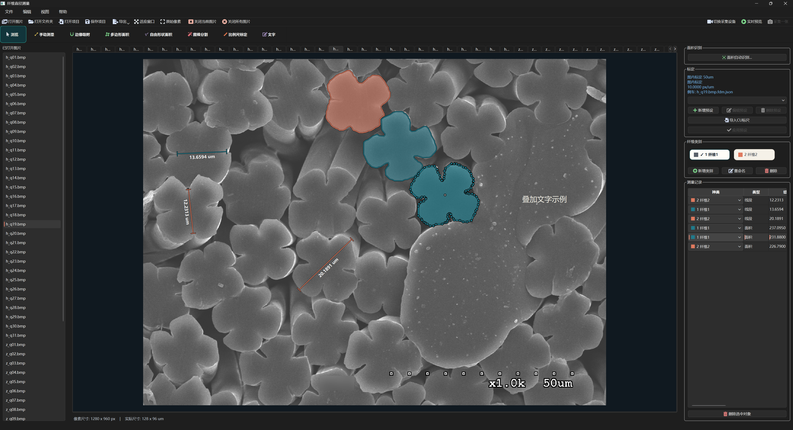
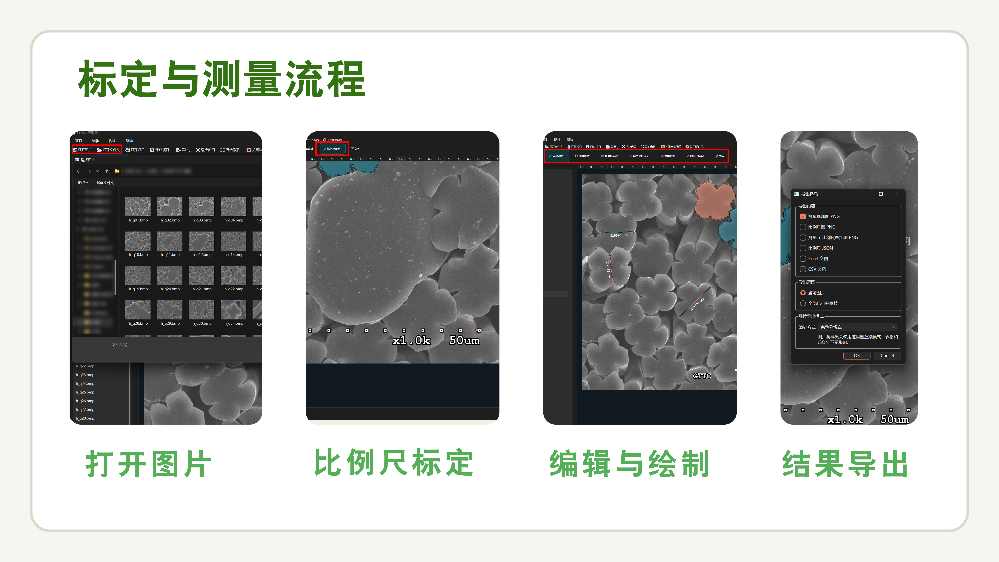
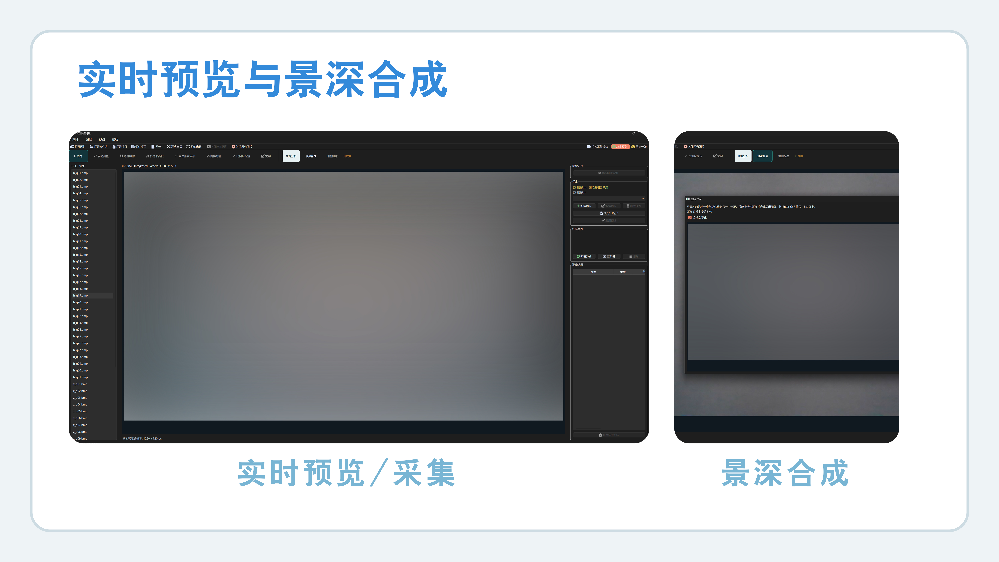
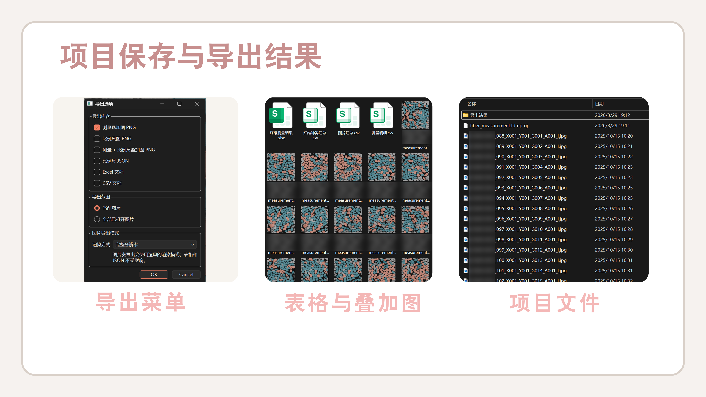

# Fiber Diameter Measurement / 纤维显微测量工作台

> 一个面向显微图像的离线桌面测量工具，用于完成纤维直径测量、面积圈定、自动识别、标尺标定、项目保存和结果导出。

> `docs/readme-assets/` 中的插图当前为占位示意图，后续可直接替换为同名真实截图。



## 项目定位

本项目是一个围绕显微图片和采集预览构建的离线测量工作台，能力范围已覆盖直径测量、面积分割、标尺标定、项目归档与结果导出：

- 面向对象是纤维类显微图像，而不是通用图片编辑。
- 核心任务是“标定 + 测量 + 分类 + 保存 + 导出”的完整业务闭环。
- 交互中心是多图片工作区，每张图片都有自己的标定、测量记录、类别、文字标注和历史记录。
- 算法能力分成三层：手工绘制、传统图像算法辅助、模型推理辅助。
- 项目保存不仅保存结构化数据，还支持把实时预览抓拍图像一起归档到项目资产目录。

本项目的核心作用可以概括为：

> 把显微图像的人工测量、半自动辅助测量、面积分割、实时采集预览和结果导出，收敛到同一个本地桌面工作流里。

## 适用场景

- 对显微图片中的纤维做直径测量。
- 对纤维区域做面积圈选、面积统计和分类记录。
- 使用本地模型辅助完成魔棒分割或批量面积自动识别。
- 在采集端实时预览显微画面，并将当前帧导入到项目中继续测量。
- 保存完整测量会话，后续继续编辑或导出 CSV / Excel / 叠加图。

## 核心能力

- 多图工作区
  - 支持同时打开多张图片或整个文件夹。
  - 图片解码走后台 worker，避免阻塞主界面。
  - 每张图片都有独立标签页、列表项和画布状态。
- 标定体系
  - 支持图内比例尺标定。
  - 支持标定预设。
  - 支持项目统一比例尺。
  - 文件系统图片会自动读写同目录侧车文件 `*.fdm.json`。
- 测量与标注
  - 手动直径测量。
  - 半自动吸附测量。
  - 多边形面积。
  - 自由形状面积。
  - 交互式魔棒分割。
  - 文字标注。
- 智能能力
  - `SnapService` 负责基于局部 ROI 的边界吸附。
  - `PromptSegmentationService` 基于内置 EdgeSAM ONNX 做点提示分割。
  - `AreaInferenceService` 调用独立 worker，基于 YOLACT 权重做面积实例识别。
- 实时预览与分析
  - 支持 USB 相机预览。
  - 支持 Microview 采集卡预览。
  - 支持抓拍当前帧进入项目。
  - 支持景深合成。
  - 地图构建逻辑已具备实现基础，但当前界面默认仍标记为“开发中”。
- 导出与归档
  - 叠加图 PNG。
  - 比例尺 JSON。
  - 图片汇总、纤维种类汇总、测量明细 CSV。
  - `纤维测量结果.xlsx`。
  - `*.fdmproj` 项目文件及其 `.assets` 资产目录。

## 典型工作流



1. 打开显微图片，或从实时预览抓拍一帧导入项目。
2. 对当前图片进行图内标定，或应用已有标定预设。
3. 创建纤维类别并切换当前激活类别。
4. 选择合适的测量方式：
   - 手动画线
   - 半自动吸附
   - 多边形 / 自由形状面积
   - 魔棒分割
   - 面积自动识别
5. 在右侧记录表中检查结果、模式、置信度、状态和所属类别。
6. 保存项目，或导出叠加图、表格和标尺文件。


## 架构与实现概览

### 1. 文档驱动的数据组织

本项目以 `ImageDocument` 作为核心数据对象，将单张图片的主要状态聚合在同一个文档模型中：

- 图片路径与来源类型。
- 标定信息。
- 纤维类别与当前激活类别。
- 线段测量、面积测量、文本标注。
- 视图缩放、平移、当前选中对象。
- 标尺锚点、脏状态、撤回 / 重做历史。

因此，本项目的大多数功能都围绕“单张图片文档”组织，便于扩展、保存和恢复。

### 2. 交互层与算法层的职责拆分

- `src/fdm/ui/main_window.py`
  - 负责菜单、工具栏、右侧面板、批量加载、项目保存、导出、实时预览编排。
- `src/fdm/ui/canvas.py`
  - 负责画布缩放平移、图上绘制、拖拽编辑、魔棒交互、选中逻辑。
- `src/fdm/services/`
  - 负责真正的算法和 I/O：吸附、导出、侧车、模型推理、预览分析、采集后端等。

这种拆分形成了清晰的职责边界：UI 负责流程编排，服务层负责能力实现，模型层负责状态管理。

### 3. 智能能力的三条实现链路

- 传统算法辅助测量
  - `SnapService` 对手工给出的近似线段做边界吸附。
- 交互式提示分割
  - `PromptSegmentationService` 使用 EdgeSAM 的 encoder / decoder ONNX。
- 批量实例识别
  - `AreaInferenceService` 启动 `src/fdm/workers/area_worker.py` 子进程，再加载 `runtime/area-infer/app/engine.py` 中的 YOLACT 推理引擎。

本项目将面积自动识别实现为独立 worker，用于隔离 `torch / torchvision / Pillow` 等重量依赖，避免将主界面线程与推理运行时直接耦合。

### 4. 持久化设计分成“侧车、项目、资产目录”三层

- 图片侧车 `*.fdm.json`
  - 只保存标定相关数据。
- 项目文件 `*.fdmproj`
  - 保存会话结构化状态，例如测量记录、类别、视图状态、标定快照、文本标注等。
- 项目资产目录 `<project>.assets/`
  - 保存抓拍导入项目、但原始磁盘路径并不存在的图片资产，例如 `captures/*.png`。

这套设计使本项目能够同时兼顾文件系统图片的原路径管理与临时采集图片的项目内归档。

### 5. 部署目标与运行环境

- 主界面使用 `PySide6`，适合桌面打包。
- 运行时内置 `runtime/camera/microview/` DLL 与驱动资源。
- `scripts/build_windows_onedir.py`、`packaging/pyinstaller/`、`packaging/inno-setup/` 都说明项目已经考虑 Windows 发行流程。
- 面积自动识别 worker 当前桌面集成默认走 CPU 推理，符合“无独显也能跑”的目标。



## 模块结构

| 模块 | 主要职责 | 说明 |
| --- | --- | --- |
| `src/fdm/app.py` | 应用入口 | 启动 Qt 应用、安装异常钩子、写启动日志 |
| `src/fdm/models.py` | 领域模型 | 文档、标定、类别、测量、项目状态、脏标记 |
| `src/fdm/ui/main_window.py` | 主窗口编排 | 文件操作、工具栏、右侧面板、导出、预览、worker 协调 |
| `src/fdm/ui/canvas.py` | 图像画布 | 绘制、编辑、缩放、交互式分割和选中逻辑 |
| `src/fdm/services/snap_service.py` | 半自动吸附 | 在局部 ROI 内做边界定位 |
| `src/fdm/services/prompt_segmentation.py` | 魔棒分割 | 基于 EdgeSAM ONNX 的点提示分割 |
| `src/fdm/services/area_inference.py` | 面积自动识别入口 | 调用独立 worker 并解析结果 |
| `src/fdm/workers/area_worker.py` | 推理子进程 | 加载参考引擎并做 CPU 推理 |
| `src/fdm/services/capture.py` | 采集管理 | USB 相机 / Microview 统一抽象 |
| `src/fdm/services/preview_analysis.py` | 预览分析 | 景深合成、地图构建分析器 |
| `src/fdm/services/export_service.py` | 结果导出 | PNG / JSON / CSV / XLSX |
| `src/fdm/services/sidecar_io.py` | 标尺侧车 | 读写 `*.fdm.json` |

## 目录导览

```text
fiber-diameter-measurement/
├─ src/fdm/                    主程序源码
│  ├─ ui/                      界面、画布、对话框、后台 worker
│  ├─ services/                算法与 I/O 服务
│  ├─ workers/                 独立推理 worker
│  ├─ models.py                核心数据模型
│  ├─ settings.py              应用设置与运行时路径解析
│  └─ app.py                   桌面应用入口
├─ runtime/                    随程序分发的运行时资源
│  ├─ segment-anything/edge_sam/
│  ├─ area-infer/
│  ├─ area-models/
│  └─ camera/microview/
├─ tests/                      回归测试
├─ packaging/                  PyInstaller / Inno Setup 打包配置
├─ scripts/                    构建脚本
├─ sample_data/                示例说明与演示图片
└─ docs/readme-assets/         README 插图资源
```

## 运行时资源约定

### EdgeSAM 魔棒分割

- 路径：`runtime/segment-anything/edge_sam/`
- 关键文件：
  - `edge_sam_encoder.onnx`
  - `edge_sam_decoder.onnx`
- 作用：为画布中的点提示交互分割提供本地 ONNX 推理能力。

### 面积自动识别

- 引擎参考代码：`runtime/area-infer/app/`
- 第三方模型代码：`runtime/area-infer/vendor/yolact/`
- 权重目录约定：`runtime/area-models/`
- Python 额外依赖：`torch`、`torchvision`

注意：

- 仓库里已经包含面积识别的运行时框架和 vendor 代码。
- 业务权重文件是否随发行包提供，取决于你的交付方式；源码仓库里不一定自带完整 `.pth` 权重。

### 相机采集

- 通用 USB 相机：通过 Qt Multimedia 接入。
- Microview 设备：通过 `runtime/camera/microview/` 下的 DLL 和驱动文件接入。
- Microview 相关链路明显依赖 Windows 运行环境。

## 数据文件说明

| 文件 | 作用 | 说明 |
| --- | --- | --- |
| `*.fdm.json` | 图片标尺侧车 | 保存标定信息和标定线，不保存完整测量结果 |
| `*.fdmproj` | 项目文件 | 保存图片列表、测量记录、类别、视图状态、文本标注等 |
| `<project>.assets/` | 项目资产目录 | 保存抓拍进入项目的图片资源 |
| `图片汇总.csv` | 导出统计 | 按图片聚合 |
| `纤维种类汇总.csv` | 导出统计 | 按类别聚合 |
| `测量明细.csv` | 导出统计 | 明细级记录 |
| `纤维测量结果.xlsx` | 综合导出 | 多 sheet 汇总 |



## 已验证的测试覆盖

本项目当前的自动化回归用例主要覆盖以下内容：

- `tests/test_models_project_io.py`
  - 项目文件往返读写、类别、标定预设、项目资产路径解析。
- `tests/test_history_and_sidecar.py`
  - 撤回 / 重做、标尺侧车读写。
- `tests/test_raster_and_snap.py`
  - 旋转 ROI、半自动吸附的边界定位与退化场景。
- `tests/test_prompt_segmentation.py`
  - EdgeSAM 路径解析、embedding 缓存、掩码转多边形。
- `tests/test_preview_analysis.py`
  - 景深合成、地图构建的稳定性判断与拼接逻辑。
- `tests/test_ui_canvas_and_export.py`
  - 画布交互、导出渲染、实时预览抓拍进入项目等行为。

这表明本项目不仅提供界面功能，也对关键业务链路建立了较系统的自动化验证。

## 快速开始

### 环境要求

- Python `3.11+`
- 推荐系统：Windows 10 / Windows 11
- 基础依赖见 `pyproject.toml`

### 安装依赖

```bash
python -m venv .venv
source .venv/bin/activate
pip install -e .
```

如需启用“面积自动识别”，请额外安装：

```bash
pip install -e .[area-infer]
```

### 启动应用

```bash
python -m fdm
```

或：

```bash
fdm
```

## 开发与测试

运行测试：

```bash
python -m unittest discover -s tests
```

Windows 打包：

```bash
python scripts/build_windows_onedir.py
```

相关文件：

- `packaging/pyinstaller/fdm_onedir.spec`
- `packaging/inno-setup/fdm_installer.iss`

## 当前状态与注意事项

- 本项目名称虽然强调“直径测量”，但当前实际能力已经覆盖直径、面积、文字标注、实时预览分析和结果导出。
- `地图构建` 相关分析器与测试已经存在，但主界面默认仍将其视为开发中能力。
- 面积自动识别依赖额外 Python 包和模型权重，源码环境下不会自动帮你补齐这些文件。
- 如果运行环境缺少 `QtMultimedia` 或 Microview 相关 DLL，实时预览能力会降级或不可用。
- `sample_data/` 目前只放了最小示例说明和演示图片，不包含完整业务数据集。

