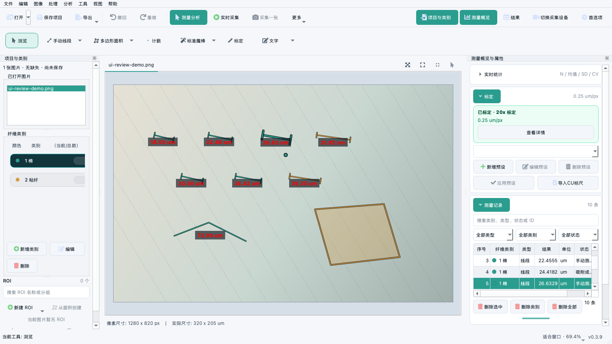
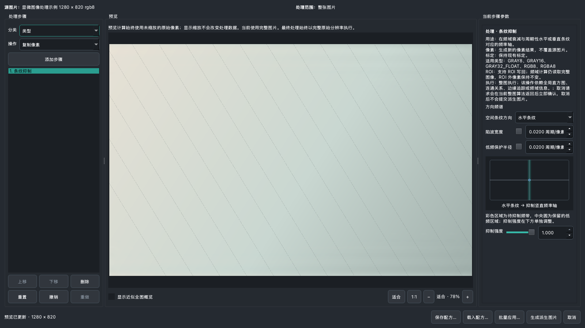
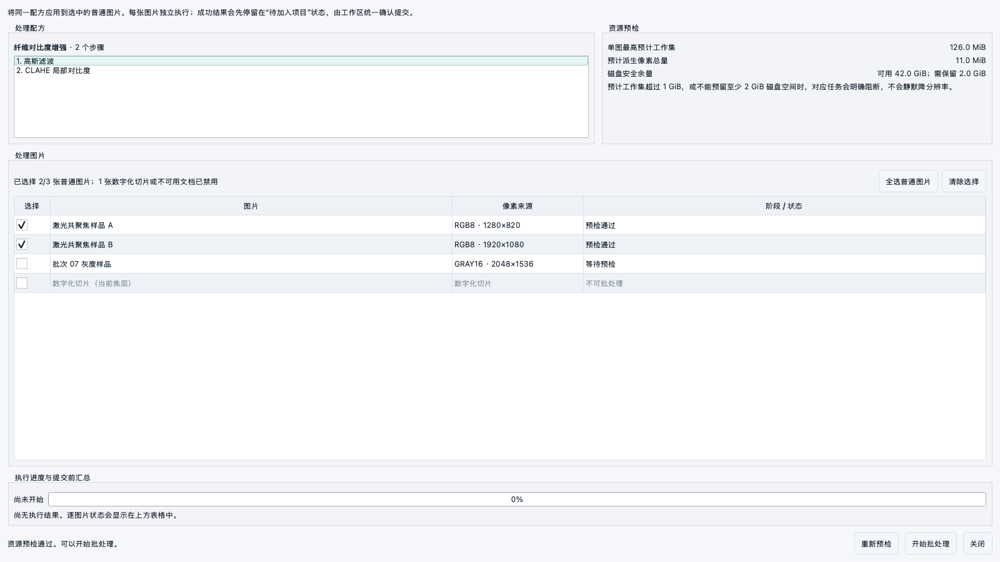
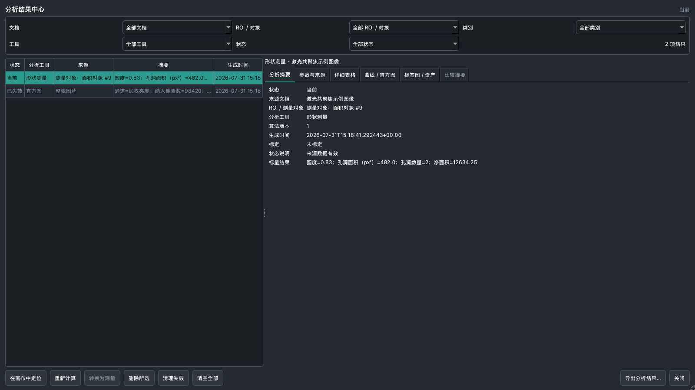
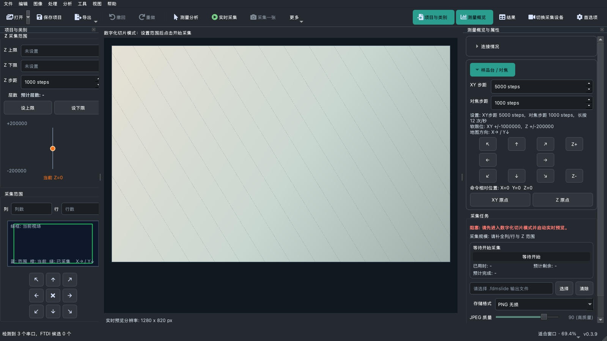

# Fiber Diameter Measurement / 纤维显微测量与分析工作台

Fiber Diameter Measurement（FDM）是一款离线桌面软件，用于把显微图像的采集、标定、测量、非破坏性处理、定量分析、结果复核和导出放进同一个项目工作流。它既保留了纤维直径与面积测量这一核心用途，也提供项目级 ROI、图像处理配方、批处理、数字化切片和可追溯的分析结果中心。



| 项目 | 当前状态 |
| --- | --- |
| 源码版本 | `0.4.3` |
| 桌面界面 | PySide6 / Qt 6 |
| Python | `3.11+` |
| 主要发布平台 | Windows 10 / 11；基础离线图像能力也可从源码在常规桌面环境运行 |
| 数据方式 | 本地项目文件与本地运行时资源，不依赖云端服务 |
| 许可证 | GNU GPL v3 |

## 功能总览

| 模块 | 主要能力 |
| --- | --- |
| 图片与项目 | 打开图片、文件夹、`.fdmproj` 项目和 `.fdmslide` 数字化切片；多图片标签页和拖放；Windows 文件关联与单实例转发 |
| 标定与测量 | 比例尺标定、标定预设、手动与连续测量、边缘吸附、计数、多边形/自由形状面积、魔棒分割、同类扩选、快速测径 |
| 辅助几何与对象捕捉 | 点、有限线/射线/无限线、圆、中点/交点、平行/垂直/阵列及相切构造；端点、中点、圆心、象限点和交点捕捉 |
| 类别、ROI 与标注 | 项目级类别模板，矩形/椭圆/多边形/自由形状 ROI，ROI 布尔组合，文字/矩形/圆形/线段/箭头叠加 |
| 图像处理 | 高位深像素、显示调整、有序处理步骤、实时预览、处理配方、分块执行和批量处理；生成派生图片，不覆盖原图 |
| 图像分析 | 形状、灰度/颜色、直方图、频谱、剖面、粒子，以及方向性、骨架、局部厚度、纹理和空间分布等高级分析 |
| 实时采集 | 通用 USB 相机、OpenCV/Qt Multimedia 采集链路、Windows Microview、单帧抓拍、景深合成和相邻视野地图构建 |
| 常驻截图工具 | 独立托盘进程、可配置全局快捷键、区域/窗口/显示器/全屏/上次区域截图、标注编辑、保存/剪贴板及 Windows 登录自启 |
| 数字化切片 | 三轴样品台控制、多焦层网格采集、PNG/JPEG tile、`.fdmslide` SQLite 存储、平滑浏览和压缩副本 |
| 复核与导出 | 测量记录、实时统计和分布；分析结果筛选、定位、重算和比较；图片、CSV、Excel、JSON 与便携分析包导出 |

## 标定、测量与标注

工作台以图片为基本测量对象。项目会分别保存每张图片的标定、类别、测量记录、叠加标注和视图状态；撤回/重做历史只在当前会话中维护，不写入项目文件。

- **标定**：图内比例尺标定、标定预设、项目统一比例尺和 CU 标尺导入。
- **直径与长度**：手动线段、连续折线、边缘吸附和快速测径。
- **面积**：多边形、自由形状、标准魔棒和同类扩选；面积对象可保留内部孔洞。
- **计数**：在原图坐标中逐点计数，可随其它测量一起统计和导出。
- **编辑**：移动线段端点，修改面积外轮廓和孔洞，调整类别、颜色与对象外观。
- **叠加标注**：文字、矩形、圆形、直线和箭头。
- **结果复核**：右侧记录表提供类别、类型、结果、单位、模式、置信度、状态和 ID；底部结果中心提供记录、描述统计与分布视图。
- **查看体验**：适合窗口、原始像素、连续缩放、导航概览、F11 全屏测量，以及可切换的左右侧栏和底部结果区。

标准魔棒与同类扩选使用本地 EdgeSAM / EdgeSAM-3x ONNX 模型。快速测径会先分割目标，再异步计算代表直径线；面积自动识别则通过隔离 worker 和已配置的权重批量生成实例。

## 项目级 ROI、图像处理与批处理

项目 ROI 与普通面积测量分开管理，可使用矩形、椭圆、多边形或自由形状，也可以从已有面积对象创建。ROI 支持名称、分组、颜色、显示/锁定状态，以及并集、交集、差集和异或组合；处理和分析都可以把 ROI 作为明确的输入范围。

图像处理工作台始终从冻结的原始像素快照开始。用户可以按顺序添加步骤、调整参数、预览完整链路、保存或加载配方，最后生成新的派生图片。原始图片、已有测量、标注和 ROI 不会被处理链改写。

主要处理类别包括：

- 像素类型与通道：`GRAY8`、`GRAY16`、`GRAY32_FLOAT`、`RGB8`、`RGBA8`，以及 RGB 通道拆分/合并和颜色转换。
- 几何与采样：裁剪、缩放、旋转、平移、画布尺寸和像素合并。
- 滤波与增强：均值、高斯、中值、双边、反锐化、归一化、直方图均衡、CLAHE、色阶、亮度/对比度与色彩平衡。
- 边缘、二值和形态学：Sobel、Laplacian、Canny、自动/自适应阈值、腐蚀、膨胀、开闭运算、孔洞/小对象处理、距离变换、骨架化和分水岭。
- 科学图像处理：背景扣除、平场校正、自定义卷积、图像计算器、FFT 带通滤波和条纹抑制。

大图处理可按操作能力采用精确分块执行；配方会在运行前校验像素类型、通道、图像语义、ROI 和资源需求。批处理只提交成功且仍与源图片版本一致的结果，取消、源图变化或结果过期时不会静默写入项目。





## 图像分析与结果中心

分析范围可以是整张图片、项目 ROI 或受支持的测量对象。基础分析包括：

- 形状测量；
- 灰度与颜色统计；
- 直方图；
- FFT 功率谱；
- 线段/折线强度剖面；
- 粒子分析；
- 极值检测。

纤维高级分析包括：

- 纤维方向性；
- 骨架网络；
- 局部厚度；
- Tubeness；
- Haralick GLCM 纹理；
- 最近邻与 Ripley K/L 空间分布；
- 二维强度表面。

每次分析都会记录工具版本、输入范围和参数，并按工具提供摘要以及可用的表格、曲线或关联资产。分析结果中心可以按图片、ROI/对象、类别、工具和状态筛选，支持在画布中定位、重新计算、多结果比较和单独删除；粒子、极值等受支持的结果还可转换为测量。源图片、ROI、测量或标定变化后，依赖它们的结果会保留但标记为“已失效/过期”，避免旧结果被当成当前结果继续使用。

分析结果可独立导出为审计型 Excel 工作簿、单表/曲线 CSV，或包含工作簿、关联资产和清单的便携 ZIP 包。批量分析使用内置的平面分析配方，常用分析覆盖亮度统计、直方图、FFT 功率谱、粒子分析和极值检测，高级分析覆盖方向性、Tubeness、GLCM、二维强度表面，并提供“亮度统计 + 直方图”和“方向性 + GLCM”组合。



## 实时采集与数字化切片

实时采集支持 OpenCV、Qt Multimedia 通用 USB 相机，以及 Windows 下的 Microview 设备链路。可用能力取决于当前后端、驱动与设备状态：

- 实时预览与单帧抓拍；
- 采集参数优化；
- 多帧景深合成；
- 相邻视野地图构建。

地图构建要求活动采集后端能够提供分析帧，并建议相邻视野保持约 20%–40% 重叠。低纹理、重复纹理、重叠不足或匹配不可靠时，系统会拒绝生成地图，避免输出错误拼接。

数字化切片工作区在实时预览基础上增加：

- 串口枚举与 FTDI 候选识别；
- X/Y/Z 相对位置、软限位、八方向点动、对焦点动与归零；
- Z 上下限、固定层间步长、X/Y 行列和固定采集步距；
- 采集范围、软限位、内存和磁盘空间预检；
- PNG 无损或 JPEG tile 编码、进度、已用时间和预计剩余时间；
- `.fdmslide` 多焦层浏览、缩放、焦层切换、步进/平滑移动和另存压缩副本；右上角可保持 `Shift+方向键` 的快速/整视场移动效果，两个移动开关都会自动记住状态。

地图指定的是覆盖范围，不会重新计算采集步距；最右列或最下行可以按设置中的固定步距越过范围边界。电机控制器创建或关闭时输出为关，但当前默认首选项会在进入数字化切片模式、且控制串口可用时尝试自动启用电机输出。首次接入设备前应在首选项中关闭“进入数字化切片界面后自动启用电机输出”，先完成连接、诊断、软限位和范围确认，再按设备安全流程启用。



## 常驻截图工具与 CU 系列实时预览

“工具 → 截图工具”可以启动独立的 `FiberScreenshotTool` 伴随进程。它在系统托盘中常驻，关闭测量工作台不会自动结束；总开关、Windows 登录自启、输出目录、文件名模板、PNG/JPEG/WebP、保存与剪贴板任务、延时、鼠标指针、交互截图标注以及各模式的全局快捷键均保存在独立的 `screenshot-settings.json` 中。标注默认关闭；CLI 可用 `--editor` 或 `--no-editor` 显式覆盖，均不指定时遵循持久化设置。

当前截图模式包括区域选择、智能窗口/子窗口、活动窗口、当前显示器、全部屏幕、上次区域，以及 CU 系列实时预览。区域选择支持拖动；智能模式会优先预选鼠标所在的前景原生窗口或控件，并可用 Tab、PageUp/PageDown 或滚轮切换该窗口内的层级。启用“交互截图后进入标注”后，截图会在原位置打开无边框标注层，提供选择、矩形、椭圆、直线、箭头、画笔、原位多行文字、编号、高亮、马赛克、真正的区域模糊和只能缩小的裁剪；对象可移动、缩放、复制、删除、调整层级并统一撤销/重做。支持光标中心缩放、1:1、适合窗口和空格/中键平移；“完成”“复制”“保存”“另存为”只有成功后才关闭，失败会保留编辑状态。`CU 系列实时预览`和`上次区域`始终即时输出，无历史区域时会明确提示而不回退到自由框选。

CU 系列专用模式不会启动第二个 Microview 实例，也不会访问或抢占采集卡。它只枚举已经运行、进程名或窗口标题带有 `CU` 标识的软件原生子窗口，并结合 `CWndForSDK`、`Static`、MFC/MDI 层级、控件标识和 4:3 视频区域特征，自动裁出“实时预览”里的视频画面而不是整个软件窗口。首次使用建议在截图设置页执行“检测 CU 系列实时预览区域”；检测后会默认选中推荐对象，也可从候选下拉框中进一步调整并记住目标。

旧版 CU 系列软件/Microview 可能使用 DirectDraw 或硬件叠加。当前 Windows 捕获链会尝试窗口捕获，并在失败或黑帧时回退到可见桌面区域；因此目标窗口应保持可见且未最小化。不同采集卡、125%/150% DPI、窗口遮挡和驱动组合仍需在目标 Windows 设备上实机确认。

## 推荐工作流

1. 打开图片、文件夹、项目或数字化切片；使用实时采集时也可以先抓拍一帧。
2. 检查图片像素类型和元数据，完成比例尺标定或应用已有预设。
3. 建立纤维类别；如需限定后续处理/分析范围，再建立项目 ROI。
4. 需要改善图像时，先做显示调整或在图像处理工作台生成派生图片，保留原图作为追溯依据。
5. 根据任务选择线段、连续测量、边缘吸附、计数、面积、魔棒、同类扩选或快速测径。
6. 需要进一步定量时执行图像分析，并在结果中心复核参数、状态、表格、曲线和关联资产。
7. 保存 `.fdmproj`，并确保配套 `.assets` 目录一起备份或移动。
8. 按用途导出测量成果、图片、原始记录模板或独立分析包。

主界面常驻图片切换、下一次测量类别和标定状态。未标定图片会明确显示“结果为 px / px²”，可直接从提示应用已有标定预设。工具栏的“导出模板”和“叠加图”可直接进入原有导出窗口；专注测量、结果复核布局可从“视图”或“更多”切换。详细说明见 [测量工作台使用说明](docs/measurement-workbench.md)。

## 输入、项目与输出文件

### 图片输入

| 格式 | 说明 |
| --- | --- |
| PNG、JPEG、BMP、WebP | 支持常见灰度、RGB/RGBA 图片；读取时应用可用的 EXIF 方向信息 |
| TIFF | 支持单页二维 `GRAY8`、`GRAY16`、`GRAY32_FLOAT`、`RGB8`、`RGBA8`；不支持 TIFF 图像堆栈 |
| `.fdmslide` | FDM 数字化切片；以 SQLite 保存清单、多焦层 tile 和采集状态 |

支持的图片元数据包括可用的 ICC 色彩配置、DPI/分辨率和原始方向。派生图片以无损 PNG 或 TIFF 写入，并在替换目标文件前执行回读校验。

### 项目文件

| 路径 | 作用 |
| --- | --- |
| `image.ext.fdm.json` | 普通图片旁的标定侧车文件，只保存该图片的比例尺信息 |
| `sample.fdmproj` | 项目主文件，保存图片引用、标定、类别、测量、标注、ROI、分析结果索引和每张图片的视图状态 |
| `sample.assets/captures/` | 项目内抓拍图片 |
| `sample.assets/processed/` | 图像处理生成的无损派生图片 |
| `sample.assets/slides/` | 项目内数字化切片 |
| `sample.assets/analysis/` | 大型分析表格、曲线、标签图或掩膜等校验资产 |

普通打开的原始图片通常仍由项目引用，不会自动全部复制进资产目录。移动或备份项目时，应同时保留 `.fdmproj`、同名 `.assets` 目录和仍被引用的外部原图。

### 导出

- **当前图片**：PNG、JPEG、TIFF、BMP、WebP；可配置格式、质量和压缩，并在目标格式支持时默认保留 ICC/DPI。16 位灰度只可无损导出为 PNG/TIFF，32 位浮点灰度只可导出为 TIFF。
- **测量图片**：测量叠加图、比例尺图、测量 + 比例尺组合图；可导出当前图片或全部已打开图片。
- **测量数据**：`图片汇总.csv`、`纤维种类汇总.csv`、`测量明细.csv` 和多工作表 `纤维测量结果.xlsx`。
- **标定**：比例尺 JSON。
- **原始记录**：按首选项中配置的 Excel 模板和单元格映射写入。
- **分析结果**：Excel、单表/曲线 CSV、便携 ZIP 分析包。

数字切片的图片导出只针对当前焦层的当前原始像素视口，不会把整个切片数据库直接拼成一张全图。测量/比例尺叠加图属于 8 位渲染结果；高位深原图或派生图应通过“导出当前图像”选择无损格式保存。

## 安装与启动

### 运行要求

- Python `3.11+`。
- Windows 10 / 11 是完整硬件链路和正式安装包的主要平台。
- macOS/Linux 可用于源码下的基础图片测量、处理与分析，但不代表 Microview、全部相机插件或 Windows 安装器受支持。
- 模型推理和大图处理的内存、磁盘与加速设备需求取决于图片尺寸、配方和所选模型。

### 基础安装

在仓库根目录执行：

```bash
python -m venv .venv
```

Windows PowerShell：

```powershell
.\.venv\Scripts\Activate.ps1
python -m pip install --upgrade pip
python -m pip install -e .
python -m fdm
```

macOS/Linux：

```bash
source .venv/bin/activate
python -m pip install --upgrade pip
python -m pip install -e .
python -m fdm
```

安装后也可以使用控制台入口：

```bash
fdm
fdm-screenshot-tool --show-settings
```

应用可直接接收关联文件路径：

```powershell
FiberDiameterMeasurement.exe "C:\path\sample.fdmproj"
FiberDiameterMeasurement.exe "C:\path\sample.fdmslide"
```

Windows 安装器默认提供 `.fdmproj` 和 `.fdmslide` 文件关联；普通图片格式不会被接管。再次打开关联文件时，现有应用实例会接收请求并切换到目标内容。

## 可选依赖与运行时资源

| 能力 | 依赖/资源 | 说明 |
| --- | --- | --- |
| 基础测量、处理与分析 | `pip install -e .` | 包含 PySide6、OpenCV、NumPy、Pandas、OpenPyXL、ONNX Runtime、Pillow、tifffile 和 pyserial |
| 面积自动识别 | `pip install -e ".[area-infer]"` + 受信任面积模型 | 增加 PyTorch / torchvision；模型必须通过正式资源清单和安全加载规则 |
| 复杂孔洞交互分割 | `pip install -e ".[interactive-seg]"` + 对应模型 | 增加 PyTorch、torchvision、timm 和 segment-anything-hq |
| 开发测试 | `pip install -e ".[dev]"` | 增加 pytest |
| PyInstaller 打包 | `pip install -e ".[packaging]"` | 仅提供 PyInstaller；Windows 安装器还需要 Inno Setup |
| Microview | `runtime/camera/microview/` + 厂商驱动/控件 | 仅 Windows；缺失时不影响基础离线图片功能 |
| 标准魔棒 | `runtime/segment-anything/edge_sam*/` | EdgeSAM-3x 缺失时会回退到标准 EdgeSAM |

`runtime/area-models/` 和 `runtime/content-templates/` 可以作为未跟踪的私有构建覆盖层存在，公开源码或公开安装包不保证包含这些业务资源。源码环境默认拒绝任意自定义面积 checkpoint；只有在确认来源可信且内容为兼容的纯 tensor `state_dict` 后，才可在受控调试环境临时使用 `FDM_ALLOW_UNTRUSTED_AREA_MODELS=1`。该开关在 frozen/full 正式包中无效。

独立面积推理容器的部署与鉴权说明见 [`runtime/area-infer/README.md`](runtime/area-infer/README.md)。

## 常用快捷键

| 快捷键 | 操作 |
| --- | --- |
| `Ctrl+O` | 打开图片 |
| `Ctrl+S` | 保存项目 |
| `Ctrl+Z` / `Ctrl+Shift+Z` | 撤回 / 重做 |
| `Ctrl+W` / `Ctrl+Shift+W` | 关闭当前图片 / 全部图片 |
| `Ctrl+PgUp` / `Ctrl+PgDown` | 上一张 / 下一张图片 |
| `B` | 手动线段与边缘吸附切换 |
| `1–9` | 切换新测量的纤维类别；魔棒剔除时 `1/2/3` 保留为剔除形状快捷键 |
| `Alt+1–9` | 切换纤维类别，魔棒剔除时也可使用 |
| `T` | 多边形 / 自由圈选的添加与剔除切换 |
| `Ctrl+K` | 查找并执行已有功能 |
| `Delete` | 删除选中对象 |
| `F11` | 进入或退出全屏测量 |
| `Ctrl+,` | 打开首选项 |
| `M` | 数字切片平滑移动开关 |
| `Shift+方向键` | 数字切片平滑模式快速移动 / 步进模式整视场移动（右上角可保持） |

完整说明可从应用的“帮助 → 快捷键说明”查看。

新版工作台的操作变化与验证范围见 [测量工作台说明](docs/measurement-workbench.md)。

## 开发、测试与界面审查

安装开发依赖并运行完整测试：

```bash
python -m pip install -e ".[dev]"
python -m pytest -q
```

发布链快速检查：

```bash
python -m pytest -q tests/test_build_support.py tests/test_build_windows_onedir.py tests/test_build_windows_installer.py tests/test_release_self_check.py
```

项目提供不依赖相机或业务数据的确定性 UI 截图入口：

```bash
python -m fdm.ui_snapshot --scenario measurement --theme dark --width 1600 --height 900 --scale 1
```

支持测量、结果、采集、数字切片、设置、ROI、图像处理、批处理、高级分析和导出等场景。默认输出到已忽略的 `build/ui-review/`；详细的 DPI 与人工检查要求见 [`docs/ui-review.md`](docs/ui-review.md)。画布性能基准见 [`docs/canvas-benchmark.md`](docs/canvas-benchmark.md)。

## Windows 打包与发布

在具备完整内部运行时资源的 Windows 环境中，默认生成 full PyInstaller onedir：

```powershell
python -m pip install -e ".[area-infer,packaging]"
python scripts/build_windows_onedir.py
```

公开 checkout 通常不含私有面积模型和原始记录模板，应显式生成公开 onedir：

```powershell
python scripts/build_windows_onedir.py --public-release
```

生成 Inno Setup 安装器；默认会先重建干净的 full onedir：

```powershell
python scripts/build_windows_installer.py
```

产物位于：

- `dist/windows/FiberDiameterMeasurement/`
- `dist/installer/fiber-diameter-measurement-setup-<version>[-variant].exe`

默认完整安装器不带 variant 后缀；排除单项私有资源时使用 `-no-area-models` 或 `-no-content-templates`，两项都排除时使用 `-public`。

常用发布选项：

```powershell
# 只同步 src/fdm/version.py 到 Inno Setup 版本文件
python scripts/build_windows_installer.py --sync-only

# 已确认现有 onedir 的版本、资源选择、提交和 manifest 一致时复用
python scripts/build_windows_installer.py --reuse-onedir

# 生成不包含私有模型和原始记录模板的公开包
python scripts/build_windows_installer.py --public-release

# 正式发布：要求干净工作区并严格校验固定资源哈希
python scripts/build_windows_installer.py `
  --strict-release `
  --strict-asset-hashes
```

`--public-release` 等价于同时传入 `--exclude-area-models --exclude-content-templates`；两个单项参数仍可独立使用。

该参数只控制 onedir/安装器产物的资源收集，不会代替 Git 源码检查。向 GitHub 推送源码前，仍应确认 `runtime/area-models/` 和 `runtime/content-templates/` 中的内部文件未被 Git 跟踪。

`src/fdm/version.py` 是版本号唯一来源；`packaging/inno-setup/version.auto.iss` 由打包脚本同步。onedir 构建会生成发布清单并自动运行打包后 `--self-check --json`，因此源码根目录缺少 `release-manifest.json` 时不应把该自检命令当作常规源码测试。

## 目录结构

```text
fiber-diameter-measurement/
├── src/fdm/                  # 应用入口、领域模型、服务与 PySide6 界面
│   ├── services/             # 采集、处理、分析、项目资产与导出服务
│   ├── ui/                   # 主窗口、画布、工作台、对话框和控制器
│   └── workers/              # 隔离式面积识别 worker
├── tests/                    # 单元、集成、UI、发布与性能回归
├── runtime/                  # 模型、相机运行时、面积 worker 和可选模板
├── packaging/                # PyInstaller、Inno Setup 与应用图标
├── scripts/                  # Windows onedir / installer 构建脚本
├── docs/                     # UI 审查与画布基准说明
├── pyproject.toml            # Python 依赖、extras 与 CLI 入口
└── runtime_assets.toml       # 正式包的资源 profile、哈希与功能清单
```

## 当前边界

- TIFF 仅支持单页二维图片，不支持多页堆栈、DICOM 或相机 RAW。
- 数字化切片不是通用全景切片格式，普通图片批处理也不接受整张数字化切片。
- 数字化切片图片导出只处理当前焦层的当前原始像素视口；批量分析必须显式冻结当前视口，不会扫描整片。
- Microview SDK 链路仅在 Windows 启用；三轴控制使用 pyserial，但其它平台的端口、驱动和整机兼容性未作完整承诺。
- 面积自动识别、复杂交互分割和高精度魔棒取决于可用依赖与模型资源；缺失时相关入口会禁用、报出明确原因或按设计回退。
- 地图构建依赖可靠纹理、足够重叠和稳定采集帧，不保证所有样品都能成功拼接。
- 本项目提供测量和图像分析工具，但最终计量流程、标定标准与结果解释仍应由使用方按其质量体系复核。

## 许可证与第三方组件

本项目依据 [GNU General Public License v3.0](LICENSE) 发布。使用、修改或再分发时请遵守 GPLv3，并保留相应版权与许可证信息。第三方库、模型和厂商运行时的归属与额外条款见 [`THIRD_PARTY_NOTICES.md`](THIRD_PARTY_NOTICES.md)。
