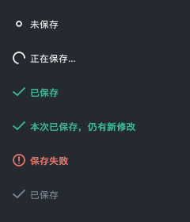

# 后台保存与保存状态

## 使用

- 使用 **Ctrl+S**、文件菜单的“保存项目”或顶部保存按钮。首次保存仍需选择项目文件的位置。
- 保存按钮旁显示状态；超过 150 ms 的保存显示旋转动画。快速保存直接显示绿色“已保存”，强调 3 秒后转为低调样式。
- 保存期间可以继续缩放、切图、测量和标注。保存的是本次按键时已经提交的内容；之后的修改仍显示为未保存。
- 连续按 Ctrl+S 时仅执行一个写入任务，最多保留一个后续请求，以最后一次按键时的快照为准。没有再次按保存的新修改不会自动保存。
- 保存失败时，点击状态提示可查看原因或重新保存。重试使用当前最新内容。
- 保存期间关闭图片、关闭软件或切换项目，会先等待保存完成；点击状态提示可以取消关闭／切换。保存失败时保留当前工作区；保存期间若又有修改，关闭前仍会按原流程确认。
- 较窄窗口中状态收为图标，悬停可查看状态、路径和上次保存时间。

## 实现说明

保存分为主线程冻结数据、工作线程写入、主线程确认结果三个阶段。GUI 的保存入口使用异步协调器；同步 `save_project()` 接口保留给脚本和测试，并复用相同的存储执行函数。

- 冻结内容包含持久化 payload、文档状态标记、来源描述、原生像素引用、编码元数据、水印 PNG 字节和分析资产路径。工作线程不访问实时文档、窗口或画布。
- 不可变原生像素直接共享；仅有 QImage 的旧路径使用 Qt 隐式共享，在工作线程转换。不会为了保存复制整张原图或复制撤销历史。
- 工作线程负责资源验证、复制／编码、旧格式备份和原子 JSON 发布。数字切片备份使用工作线程自己的 SQLite 连接。
- 成功后只合并资源路径及对应的保存标记，保留新测量、新标定、新水印、新分析结果和更新后的分析失效状态。期间另外保存过的标定侧车标记也会保留。
- 每次异步结果同时校验请求编号与工作区代次。等待写入结束前不清空会话资源，不强行终止保存线程。
- 原生资源继续使用已验证的 `RasterAssetReceipt`，未修改的 DSX／POIR 不重复编码或完整读取哈希。
- 后台保存保留旧修订资源，避免清理仍被排队快照、当前分析或撤销操作引用的文件；普通重复保存不会产生新的像素修订。像素／分析资产版本发生变化时，旧版本可能增加磁盘占用。同步兼容接口仍保留原有提交后清理逻辑。

首次构造持久化快照仍在主线程完成，因此极多测量对象的项目需要单独测量快照准备时间；日志记录 `prepare_ms`、`write_ms` 和 `apply_ms`，避免把所有耗时归到磁盘写入。

项目文件格式、用户设置格式和应用版本保持不变。本功能没有启用自动保存。

## 验证

见 [开发验证与性能记录](validation/background-save-2026-09-26/README.md)。Windows 打包自检增加 `functional_checks.project_save`；缺失或失败会阻止构建自检通过。Windows 安装后实测另行验收。
