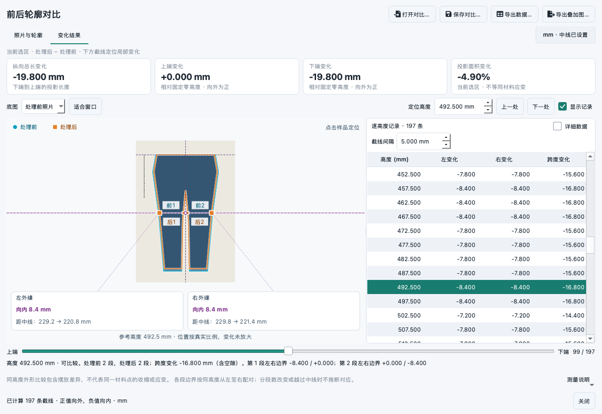

# 处理前后轮廓对比

入口：**分析 → 前后轮廓对比…**。用于固定俯拍条件下，比较牛仔裤等物体洗涤、浸泡、烘干或蒸汽处理前后的平面外形。

这是可直接使用的独立对比工作区：自动提取轮廓、魔棒点选、手动修边、设置中线和标定、逐高度比较、保存重开、导出 Excel 与叠加示意图。原照片、原项目和已有测量不被修改。基础识别和手动工具无需模型；魔棒复用软件现有的标准魔棒模型与 ONNX Runtime，不增加其他模型框架。



## 操作

1. 分别点击“处理前”和“处理后”空画布中的导入按钮，或标题旁的“导入照片”。下拉菜单也可选用主窗口已打开的普通图片。导入后自动识别物体，彩色覆盖表示参与计算的范围；“正在编辑”标识当前操作对象。
2. 检查轮廓。复杂背景可选“魔棒”，在目标内部点一下，再继续补点；Alt＋点击或勾选“点选排除背景”后点击可排除背景。也可使用“补画／剔除”“圈入／圈除”精修，或用“框选识别”、深色／浅色自动识别。所有已应用的修改均可撤销。
3. 检查中线。点击“设中线”，第一点选**固定参考高度的原点**，第二点沿物体中线朝下摆方向选取。第二点仅决定方向，不参与比例缩放。自动建议尚未核对时，软件会明确提示。
4. 点击“标定”，在与衣物同平面的标尺上点两端，再输入实际长度（mm）。固定机位且图像尺寸相同时，默认共用中线与标定，只需设置一次。不同像素尺寸会关闭共用，需分别设置。顶部“共用中线和标定”可手动取消：现有值保留，之后分别修改；重新勾选时以处理前为准。右上状态按钮会定位到缺少的照片、标定或中线工具。
5. 打开“变化结果”。上方卡片显示当前选区整体的总长、上／下端、投影面积变化；下方定位当前高度的局部变化。默认以处理前照片为底图，点击样品、表格行、滑条或输入定位高度，紫色截线、蓝色圆点（前）、橙色方点（后）和左右外缘数值同步定位。“上一处／下一处”和画布上的上下方向键也可连续查看。“详细数据”展开前后距离和状态；取消“显示记录”可集中看图。修正后自动重算，并保留手动调整的结果视角；中线、标定或源图改变时重新适合窗口。

滚轮缩放、按住右键拖动；多边形按 Enter 或双击完成，Esc 取消当前修正。撤销／重做支持窗口内的系统标准快捷键（Windows 为 Ctrl+Z 等）。画笔保留完整鼠标采样，松键后应用本次修正。可取消“显示覆盖”直接核对原照片纹理，该开关不改变计算范围。

工具参数在固定区域内切换，照片不会随魔棒、画笔参数的显隐跳动。截线间隔可在编辑页顶部或结果记录区修改，两处同步；它是采样间隔，不代表测量精度。长文件名和提示可悬停查看全文，“测量说明”中可滚动查看完整说明。

以下新增快捷键只在画布获得焦点时生效，不占用数值框输入：

| 按键 | 操作 |
| --- | --- |
| V / W / B / E / P | 查看／魔棒／补画／剔除／圈入 |
| X | 切换补画与剔除，或圈入与圈除；不会丢弃未完成多边形 |
| [ / ] | 缩小／放大画笔半径 |
| Backspace | 退回多边形的上一个点 |
| 空格＋左键拖动 | 临时平移，保留当前工具；查看模式也可直接左键拖动 |
| F | 适合窗口；魔棒仍自动应用，不需要 F 确认 |
| ↑ / ↓ | 在结果画布中定位上一条／下一条截线 |

### 魔棒的三种操作

| 操作 | 适用情形 |
| --- | --- |
| 替换轮廓（默认） | 自动识别选错了背景，重新点选整个目标 |
| 补入轮廓 | 保留现有轮廓，补入漏选区域 |
| 剔除区域 | 保留现有轮廓，扣除点选到的区域；负点开关显示为“点选保留部分”，表示本次不应剔除的部分 |

每次识别完成立即应用，不需要按 F 确认。连续补点和排除背景始终基于本次点选开始时的轮廓，因此修正剔除范围时，可以把前一次误剔的区域恢复回来。“重新选点”清除当前图片的提示点，保留已应用轮廓；切换操作类型会开始新一组点选。两张图各自保留提示点，手动改动某张图后，该图的旧提示点作废。

魔棒模式下，Esc 结束本次点选，保留已应用的轮廓；识别尚未完成时会取消它。需要恢复已应用结果时使用撤销。模型缺失或识别失败会说明原因并保留原轮廓；仍可使用画笔、多边形和基础自动识别。模型与主窗口的“标准魔棒”设置保持一致，后台只保留两个源图像的特征缓存。

魔棒轮廓是建议选区，标尺遮挡、毛边、离开画面的延伸和相似背景仍需复核。提示点和照片边缘附近的截断提示不会自动扩展几何，也不会把模型猜测转换成实际尺寸证据。

### 在结果图上读数

左右卡片分别通过引线连接当前截线的外缘，显示“向内／向外”、变化量和前后到中线的距离；位置按真实比例显示，变化不被夸大，放大画布也不会把文字和端点一起放大。底图可切换为处理后照片或仅轮廓；该切换不改变计算结果。

腿缝、孔洞等造成多段交集时，截线上保留每个真实交点；空间足够时标注“前1／后1”等段号，对应下方的分段说明。左右外缘变化与内侧边界变化不能互相替代。某侧无法比较时直接显示“此侧无法比较”，不把不存在的轮廓写成零。

取消照片导入、对比打开、保存或导出文件选择器后，返回当前对比窗口，照片、轮廓和未保存状态均保留。原生选择器打开期间暂停待运行的重算，返回后继续，避免后台任务抢占刚选中的导入操作。

两张照片可先测像素变化，但未标定会持续显示 px，不能当作毫米。仅一张已标定时禁止输出混合单位结果。未标定且图片尺寸不同时也不直接比较。

## 数值口径

以中线原点为共同零高度，朝下摆为正高度，中线右侧为正横坐标。每条截线位于一个固定高度，两张图在各自标定和中线坐标系中求真实掩膜交集。

| 输出 | 含义 |
| --- | --- |
| 左侧变化 | 处理后左侧最外缘到中线的距离 − 处理前距离 |
| 右侧变化 | 处理后右侧最外缘到中线的距离 − 处理前距离 |
| 外缘跨度变化 | 两最外侧边界之间距离的变化；包含腿缝等空隙 |
| 各段边界变化 | 同高度各段从左到右配对的边界距中线变化，包含内侧腿缝；分段数不同或越过中线时不推断对应 |
| 上／下端向外变化 | 共同坐标系中端部伸展为正、缩短为负 |
| 纵向总长变化 | 下端到上端的投影长度之差 |
| 投影面积变化 | 原分辨率前景像素面积乘以各自标定的平方后作差；手动剔除的孔洞不计入面积 |

左右及各段边界的正值表示**离中线更远**，负值表示离中线更近。内侧腿缝边界向外移动通常意味着缝隙变宽，不意味着裤腿布料变宽。

某高度仅一张照片存在物体时，差值留空并标记“仅处理前／后有轮廓”，不会把缺失当成零宽度。分段数改变会提示内部边界需复核。跨中线或顺序配对都不被解释为材料点追踪。

截线采用原点锚定的半步长网格，例如间隔 10 mm 时为 5、15、25… mm。端部极值和面积独立于该网格计算；细短区域没有网格点时取联合高度区间中点。端部变化不会因最后一条采样线未落在端部而丢失。

**不能分别把处理前后衣物新的上端都设成零点，也不能按衣物长度自动缩放图片。** 这会抹掉实际长度变化。若相机有轻微平移／面内旋转，可取消共用，在两张照片中分别指定同一个台面参考原点和方向；软件不自动消除衣物本身的平移、倾斜或变形。

## 采集与参数建议

这些是首轮使用建议，不是已验证的计量指标。

| 项目 | 建议 |
| --- | --- |
| 拍摄 | 固定焦距、相机位置、曝光和图像尺寸，镜头尽量垂直于台面，完整拍下衣物和同平面标尺 |
| 背景 | 哑光、均匀且与衣物有明显色差；照明均匀，减少阴影 |
| 铺放 | 前后同样自然铺平；不拉伸对齐下摆，保持同一个台面中线及参考高度 |
| 中线与比例共用 | 仅适合机位、裁切、分辨率、焦距和平面高度一致的照片；不同条件分别设置 |
| 截线间隔 | 默认 10；毫米标定后可从 5–10 mm 开始，在关注区域用 1–2 mm 检查。间隔不是精度，最多 5000 条 |
| 画笔半径 | 默认 8 原图像素；大块修正用较大半径，边缘细修用 1–3 像素；放大图片便于检查 |
| 图像范围 | 常见二维 PNG/JPEG/BMP/WebP/TIFF，单张最多 3600 万像素；首版不直接读取整份数字切片或多页图像堆栈 |

现有普通图片的有效尺寸标定可被继承；8 位分析图像来自冻结的权威栅格，独立于主画布的显示调整、缩放或测量叠加。直接导入照片会应用 EXIF 方向信息；分割使用 8 位 RGBA 表示，掩膜保持照片原分辨率。

先做“不处理、重复拿起铺放”的对照最有价值：若仅重新铺放就产生 1–2 mm 假变化，应先改善采集和铺放。需要证明的是完整流程的重复性，不能把小数位数或毫米标定当作毫米精度。

## 文件和导出

- **保存对比 `.fdmcompare`**：自包含 ZIP，包含两张分析照片的无损 PNG、原分辨率掩膜、中线、人工设置状态、标定、采样间隔和来源说明。可移动文件后继续修正；历史撤销栈不持久化，当前修正结果持久化。独立格式不改变 `.fdmproj`。
- **Excel `.xlsx`**：“汇总与口径”记录来源、中线、标定和质量说明；“逐高度外缘”包含前后距离、差值、状态、每段原始交集和各边界距中线变化。空值不是零。首版独立报告不写入原纤维定量记录模板。
- **叠加图 `.png`**：保留当前底图选项、选中的高度及对应外缘标注，按完整范围输出，不继承当前视口的平移／缩放。原分辨率掩膜用于覆盖；细描边为显示代理，截线端点直接来自原分辨率计算结果。PNG 文本元数据另存前后照片名称、单位、摘要、质量说明、所选高度和底图模式。

保存和导出使用当前已完成的不可变快照，先写临时文件、成功后替换目标。未完成多边形需先 Enter 完成或 Esc 取消，避免静默遗漏。关闭有修改的工作区会询问保存，关闭后台任务会等待其安全退出。

## 算法选择与边界

此前 [局部变形研究](garment-local-deformation-research-2026-09-15.md) 比较了 DIC、标记追踪和三维方法。根据随后明确的“外轮廓相对中线变化”需求，本次实现优先测形状，无需先证明自然纹理能追踪同一材料点。有标记和无标记的照片均可使用；本版不自动识别标记编号，也不输出局部材料应变场。

自动轮廓使用边界背景颜色估计、Lab 色差与 Otsu 阈值，提供深／浅色替代；只自动保留最大连通物体，补齐封闭内部空白并提示。腿缝与外部连通，因此不会被当作孔洞填平。真实开孔、断开部件和复杂背景可手动恢复／剔除。框选或照片边界触及前景时提示可能截断。[OpenCV 阈值说明](https://docs.opencv.org/4.13.0/d7/d4d/tutorial_py_thresholding.html)、[轮廓层级说明](https://docs.opencv.org/4.13.0/d9/d8b/tutorial_py_contours_hierarchy.html)。

也调研了矩形与前／背景笔刷驱动的 [GrabCut](https://docs.opencv.org/4.13.0/d8/d83/tutorial_py_grabcut.html)。手动补画／剔除保持确定性；新加入的魔棒复用现有 EdgeSAM 路径，在整张源图上提取并缓存特征，按原图坐标接收正／负提示点并返回原分辨率掩膜。不采用显微小物体的自动 ROI 限制。选区组合保留孔洞与不连通部分，更新模型提示仅影响本次明确选择的替换／补入／剔除操作。

计算使用二值掩膜的**原生像素单元边界**和半开区间扫描求交，保留孔洞、断开部分、凹形和亚像素坐标系变换。面积由前景像素数计算；不从缩小的轮廓显示路径计算尺寸。显示路径仅作装饰，有独立的点数上限，完整掩膜覆盖始终保留。

后台采用独立的单任务 Qt 线程池，UI 线程只接收完成的快照；计算中仍可平移和缩放。只读数组在修正时复制；历史共享图像和未变掩膜，最多 20 步且额外数组预算 192 MiB，避免高分辨率图像反复修正无限占用内存。可取消计算不安装晚到结果；保存／导出作为已接受的操作完成后才允许关闭。

本版不做镜头畸变自动标定、透视矫正、三维表面长度测量或处理前后纹理相关。它测量的是二维投影形状；褶皱、离面高度、遮挡、重新铺放、衣物整体侧移，都可能改变结果。要回答“同一小块布料收缩了多少”，需继续采用有独立验证的标记标距或 DIC。

## 本地验证（2026-09-15）

最新一次界面调整、成熟项目参考与验证记录见 [首版 UI 审视与调整](garment-contour-ui-review-2026-09-15.md)。该次完整定向回归通过 175 项测试及 2 个子测试，下面保留此前功能开发阶段的验证依据。

此前基础功能与主窗口定向回归通过 123 项测试及 21 个子测试。本次最新轮廓功能回归通过 **62 项测试**；包含主窗口分析／图像处理／显示调整／查看体验、全屏快捷键、原有魔棒及运行日志的完整定向回归通过 **162 项测试和 2 个子测试**。两次回归选择的范围不同，子测试计数不直接比较。这些是源码环境验收，未生成 Windows 安装包。

验证包含已知矩形与裤形样本、多个中线角度、不同分辨率／标定、孔洞、腿缝、多段交集、丢失高度、手动补剔、撤销重做、照片快照与主窗口隔离、取消及安全关闭、保存重开、Excel 与 PNG 导出。亮／暗主题、860×640 窄窗口与 1280×880 窗口已作离屏目视检查，并覆盖 DPR 1、1.5 和 2。

合成裤形背景识别与计算的开发机记录如下；数值是 macOS 本地观察，不代表 Windows 真机或真实牛仔裤精度。

| 单张尺寸 | 单张识别 | 197 条截线的前后计算 P50 | 五次计算最长值 |
| --- | ---: | ---: | ---: |
| 1400 × 2000 | 约 35–98 ms（含首次启动） | 42 ms | 44 ms |
| 2800 × 4000 | 约 145–152 ms | 163 ms | 164 ms |
| 4200 × 6000 | 约 327–344 ms | 353 ms | 354 ms |

合成样本按共同原点施加约 3% 横向、2% 纵向缩短。结果端部长变化约 −19.6～−19.8 mm；生成时的像素取整会造成这一分辨率差异，不能拿该样本证明真实衣物的 1 mm 测量能力。

重现命令：

```bash
uv run --no-sync pytest -q tests/test_contour_comparison.py tests/test_contour_comparison_ui.py tests/test_contour_comparison_wand.py
uv run --no-sync python scripts/benchmark_contour_comparison.py --output /tmp/fdm-contour-qa --screenshots
QT_SCALE_FACTOR=1.5 uv run --no-sync python scripts/benchmark_contour_comparison.py --heights 2000 --output /tmp/fdm-contour-qa-dpr15 --screenshots
```

脚本生成明确标记为“合成验证”的可重开对比样本、尺寸／耗时 JSON 和界面截图。真实重复铺放误差、毫米准确度及 Windows 安装包仍待现场验证。

### 本次真实照片的功能验证

使用用户提供的两张 5568×3712 照片（约 2070 万像素），全部处理在本机完成，未将样品照片加入代码库。按文件名暂定前后顺序，测试中使用共同的示例参考轴、保持未标定；以下仅验证功能和响应，不是这份样品的缩水结论。

- 原有背景颜色识别会误选白色衬纸；标准魔棒点选能选中布料主体并排除该衬纸。
- 首次点选也会漏掉透明标尺下的布料，增加提示点后选区会变化；画面端部和底部散边需要人工复核。不能以自动轮廓闭合来证明整个样品已完整入镜。
- 完成魔棒补点、手动剔除、撤销、原尺寸保存重开、Excel 和带位置标注 PNG 导出。重开后的源像素和掩膜与保存前逐像素一致。
- 模型调用（含掩膜后处理）的首图首次约 423 ms，另一图首次约 202 ms；复用特征后的补点约 74–75 ms。包含界面安装及自动重算的完整操作约 0.42–1.82 s，单独列出以免混淆。
- 原图底图与双轮廓叠加下，30 次平移重绘本机 P50 约 3.67 ms、P95 约 3.99 ms；这不是 Windows 安装包的输入到呈现延迟。
- Qt Cocoa 原生照片选择器取消后，对比窗口在返回当时和 500 ms 后均保留为活动窗口；离屏回归另外覆盖全部五类文件选择入口、Esc、待运行重算和已入队结果的取消。

显示验证覆盖亮暗主题、860×640 与 1280×880 窗口、DPR 1／1.25／1.5／2、不同底图和独立旋转／标定坐标。小窗口魔棒模式的标定文字与画布不再重叠。图上端点与表格来自同一原分辨率截线，切换照片底图不会重新测量或更改结果。
