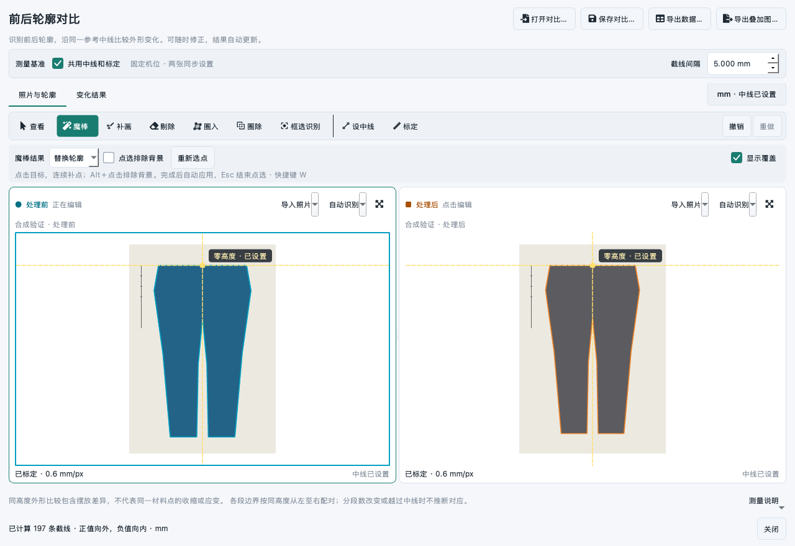

# 前后轮廓对比：首版 UI 审视与调整

日期：2026-09-15。基于 `80b8c3b` 首版源码、实际运行截图与用户提供的两张 5568×3712 照片检查。此次主要调整信息组织、工具反馈和读数定位，计算服务与文件格式不变。

## 审视结论

首版已经能完成识别、手动修正与导出，但把“功能存在”转化为“用户清楚下一步做什么”仍有距离。改善优先级为操作明确、画布稳定、结果可定位，随后才是边框、留白和图标。

| 首版观察 | 实际影响 | 本次处理 |
| --- | --- | --- |
| 工具、画笔半径、中线和标定混排；小窗口工具行可横向滚动 | 不常用参数占据空间，常用工具需要寻找 | 所有编辑工具保留直接入口；基准工具分组；仅显示当前工具的参数 |
| 魔棒参数行按需插入 | 切换工具使两张照片上下移动 | 所有工具共用固定高度的参数区域，不因参数行显隐挤动画布 |
| 中线共用仅有一个长复选框，修改对象主要靠细边框表达 | 容易误以为只能同步设置，也容易不知道正在改哪张 | 独立的测量基准区域；明确“同步／分别设置”；照片标题标记“正在编辑／点击编辑” |
| 原点的黄线缺少文字；标定状态在图片底部 | 难以判断建议中线是否人工设置，也容易忽略像素单位 | 画布标注固定零高度；每张图单列中线状态；右上状态入口直接定位缺失照片、标定或中线工具 |
| 结果摘要是一句长文字，记录表视觉权重过大 | 总体与局部变化混杂，不易连续巡查样品 | 四项整体变化卡片；局部仍由真实交点及引线连接数值；图、表、高度输入、滑条和方向键联动 |
| 默认记录列在窄窗口产生水平滚动 | 查看几个常用值也要拖滚动条 | 默认等宽显示高度、左变化、右变化和跨度变化；完整距离与状态放在“详细数据”，悬停保留状态说明 |
| 多个长文件名与警告文字参与布局 | 内容变化会挤占图片，甚至改变窗口最低宽度 | 名称和说明单行省略，悬停保留全文；可滚动的“测量说明”提供完整内容 |
| 深色主题未选中的复选框不明显，选中图标对比不足 | 用户难以发现开关或判定状态 | 采用当前调色板绘制复选框指示器；图标随主题和选中状态刷新；前后标签同时使用颜色、文字和圆／方符号 |

## 成熟项目的参考与取舍

### QuPath：图像与记录保持联系

QuPath 的测量表可持续关联图像中的对象，并通过显示／隐藏标记、填充来对照原图。这里采用“同一条截线作为唯一选择状态”：点击照片、选择记录、拖动滑条、输入高度或按上一处／下一处，都定位到同一个已计算结果。[官方操作说明](https://qupath.readthedocs.io/en/stable/docs/starting/first_steps.html#creating-measurement-tables)

保留显示覆盖、切换底图、隐藏记录表等显示操作；这些操作不写入轮廓、不重新定义尺寸，也不改变保存状态。没有添加必须确认的流程页。

### napari：把工具选择与当前参数放在一起

napari 的 Labels 控制区集中提供画笔、橡皮、多边形及相关参数；空格临时平移、方括号调整画笔，以及 Enter 完成多边形的方式，适合持续修边。[官方 Labels 文档](https://napari.org/stable/howtos/layers/labels.html)

本次保留本软件已有右键拖动、魔棒 Alt 负点与自动应用规则，新增画布内快捷操作。快捷键只在画布获得焦点时处理，不占用数值输入框中的字母、数字或方向键。

### 3D Slicer：稳定的编辑效果、选项与撤销区域

3D Slicer 的 Segment Editor 将编辑工具、选项与撤销分开组织；已读取其界面定义中对应的效果、撤销和选项区域。[官方操作说明](https://slicer.readthedocs.io/en/latest/user_guide/modules/segmenteditor.html#effects-section)、[界面源码](https://github.com/Slicer/Slicer/blob/main/Modules/Loadable/Segmentations/Widgets/Resources/UI/qMRMLSegmentEditorWidget.ui)

本功能只有一对二维轮廓，因此没有引入层级复杂的分割管理面板。采用紧凑工具栏与稳定参数区，保持每个补画／剔除工具可以直接点击。魔棒与手工修正继续复用现有撤销历史，省去新的 Apply 步骤。

这些是基于当前用户任务的设计取舍，不是照搬上述项目，也不意味着实现了这些项目的配准、三维或材料应变功能。

## 完成的交互

- 空画布中直接导入对应的处理前／后照片；标题旁仍可从主窗口已打开图片中选择。
- 不同角色分开呈现：青色圆点标记处理前，橙色方点标记处理后；“正在编辑”单独表达操作目标。
- 共用设置可随时关闭，现有中线和标定保留，后续分别修改；重新共用时明确以处理前为准。
- 魔棒仍提供替换、补入、剔除。剔除模式中，负点开关改称“点选保留部分”，避免“排除背景”造成反向理解。
- 画布支持 V 查看、W 魔棒、B 补画、E 剔除、P 圈入；X 切换成对的补／剔工具，方括号调半径，Backspace 退回一个多边形点，F 适合窗口。未完成多边形不会被 X 等快捷切换静默丢弃。
- 查看模式可左键拖动；任何编辑工具保留右键拖动，并支持空格＋左键临时平移。结束平移不产生修正。
- 结果卡片分别显示纵向总长、上端、下端及投影面积变化。选中截线的左右外缘读数仍通过引线连接真实交点；缺失值保持空值，不能显示为零。
- 截线间隔在编辑页与结果记录区同步，修改后沿用原有重算和撤销；定位滑条只浏览已经计算的高度。
- 手动平移／缩放结果视图后，普通轮廓修正保留该视角；源图、中线或标定改变时重新适合窗口。
- 860×640 时收起卡片的辅助描述，压缩图中读数卡片的留白；主要数值、单位、状态及操作仍可见。大窗口恢复完整说明。
- 原生文件选择器取消返回当前对比窗口的修复仍保留。Enter 不再触发意外的默认导入或关闭按钮。

## 视觉与性能验证

新增交互回归覆盖：空画布导入取消、工具切换不移动图片、长名称不影响布局、图像选择不改变其像素外观、临时平移不写轮廓、快捷键与未完成手势、基准入口、分别设置、五种定位入口、间隔同步及撤销、修正后保留结果视角、小窗口与不可比较数据。

本次完整定向回归通过 **175 项测试及 2 个子测试**，其中轮廓界面测试由 30 项增加至 43 项。范围包括轮廓计算／魔棒、主窗口分析与图像处理、显示调整与查看体验、全屏快捷键、原有魔棒及运行日志。小窗口后的最后一项说明显隐微调另作定向验证。

已经运行亮／暗主题、系统主题的交互检查，以及 DPR 1、1.25、1.5、2 的离屏显示检查；覆盖 860×640 与 1280×880、魔棒和三种底图。所有截图来自实际 Qt 窗口，不是静态设计稿。

重新使用用户的原照片进行魔棒补点、手动剔除、撤销、保存重开、Excel 和 PNG 导出。源图及掩膜重开后逐像素一致。该样本保持未标定，示例中线及前后顺序仅作功能验证，不能把截图读数当作实际收缩结论。用户照片仍留在本机忽略目录，代码库截图采用合成样本。

开发机上该实际样本的 30 次结果图平移重绘 P50 约 **3.08 ms**、P95 约 **3.43 ms**、最大约 **3.70 ms**。一条 UI 更新及结果重算约 0.35–1.61 s，主要由分割和原分辨率轮廓计算决定，未将这个时间误算为鼠标重绘时间。一次本机合成基线的截线计算 P50 为 43.92 ms，本轮对应为约 43.1 ms；算法没有改变。

这些是 macOS 源码环境的功能和显示验证。Windows 安装包、真实重复铺放误差和毫米计量准确度仍需现场验证。

新版操作见 [使用说明](garment-contour-comparison.md)。
