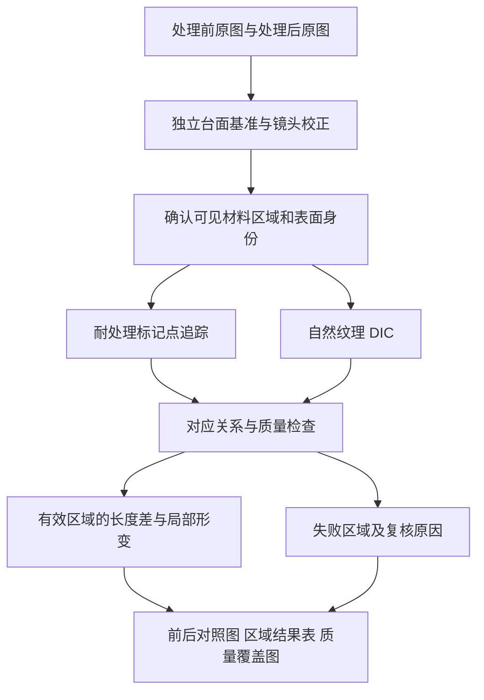

# 牛仔裤处理前后局部收缩与形变的半自动测量方案

> 后续开发说明：用户随后将本轮重点明确为“外轮廓相对中线的处理前后变化”。已据此实现独立的 [前后轮廓对比工作区](garment-contour-comparison.md)。下文保留针对材料局部收缩／应变的研究，不代表本轮已经实现或验证 DIC。

**推荐采用固定俯拍、台面几何标定、标记点追踪与自然纹理数字图像相关（DIC）共存的方案。** 目标是在普通洗涤、浸泡、烘干或蒸汽处理前后，比较同一件牛仔裤、同一可见布料部位的局部尺寸变化，优先验证能否可靠区分 1–2 mm 的局部长度差。平整区域先使用单相机二维测量；无法控制褶皱或离面运动时，再考虑双相机立体 DIC。

这条路线有成熟技术基础，但尚不能据此承诺某台相机、某类牛仔裤已经达到目标精度。相机实际成像、织物纹理、重新铺放、湿度和测量时的受力状态，均需要样品验证。本报告中的相机采样、标记间距、局部标距和验收阈值是工程起点，不是标准规定或现有设备实测结果。

**首先应把“位置变化”与“材料尺寸变化”分别报告。** 某个点向下移动 10 mm，可能只是裤腿重新摆放；同一小片布料中两点的距离从 50.0 mm 变为 48.5 mm，才表示这段可见表面在规定测量状态下缩短了 1.5 mm。DIC 的用途是寻找处理前后材料点的对应关系，再据此计算位移和形变；仅比较前后外轮廓不能确定内部哪块布料收缩了多少。Ncorr 的算法说明明确以材料点对应及局部图像子区为基础。[^1]

| 结果 | 回答的问题 | 应注意的边界 |
| --- | --- | --- |
| 位移图，mm | 某个材料点移动了多少、朝哪个方向 | 包含铺放产生的整体移动和转动 |
| 局部长度差，mm | 同一对材料点之间缩短或增长多少 | 必须给出处理前标距和测量方向 |
| 局部尺寸变化率，% | 某段材料相对初始长度变化多少 | 负值表示收缩，正值表示增长；报告中固定符号约定 |
| 局部方向变化或剪切 | 原来的方向是否发生偏转、斜交 | 裤子中线不一定是每块裁片的经向 |
| 面内面积变化，% | 同一局部材料区域在二维测量平面内的面积变化 | 有褶皱时不能解释为真实表面积或材料体积变化 |
| 有效测量覆盖图 | 哪些部位有可靠的对应点 | 无效区域必须留空或显示斜线，不能用零变化填充 |

例如，以下仅为计算示例，不是样品测量：

| 部位与方向 | 处理前标距 | 处理后标距 | 长度差 | 尺寸变化率 |
| --- | ---: | ---: | ---: | ---: |
| 左大腿，沿裤腿方向 | 50.0 mm | 48.5 mm | −1.5 mm | −3.0% |
| 右小腿，横向 | 50.0 mm | 49.5 mm | −0.5 mm | −1.0% |
| 某平整区域整体平移 10 mm | 50.0 mm | 50.0 mm | 0.0 mm | 0.0% |

“1–2 mm”还需要配套一个局部范围：50 mm 标距缩短 1 mm 是 2%；20 mm 标距缩短 1 mm 是 5%。希望辨认更小范围内的形变，就要增加可辨纹理、降低测量噪声，不能只把热力图的输出网格画得更密。NIST 的 DIC Challenge 2.0 特别指出，位移噪声、应变噪声与空间分辨率存在取舍，不同软件即使位移表现相近，应变空间分辨率仍可能明显不同。[^2]

**固定相机和中线能减少准备工作，但不能替代测量状态控制。** 固定相机有利于复用镜头参数，固定中线方向有利于初始化左右裤腿和各区域的对应关系。它们不能自动消除褶皱高度、左右裤腿开合、裤腰叠层、口袋覆盖及摆放拉力的变化。

中线应优先作为方向基准，并配合一个明确的原点或定位特征。如果夹具同时锁住腰部和裤脚，使中线长度无法自由变化，测到的就是约束条件下的形变。判断自由收缩时，不应为了让前后照片重合而拉长裤腿、压到同一外轮廓，或把多个布料点强制放回原来的台面坐标。

建议在不额外拉伸的状态下规定一种可重复铺放方法，固定正反面、门襟开合、腰部叠放方式及必要的静置时间。普通洗涤等处理后，比较时应达到相同规定的干燥、调湿和温度状态；如果业务要比较“湿态对干态”，则单独定义为另一种测量任务。压板、吸附台、重物或熨平可能改变状态，只有在试验方法明确允许、且验证不会引入显著差异时才采用。

ISO 3759:2011 涵盖织物、服装在特定处理后的尺寸变化试验所需的准备、标记和测量；ISO 5077:2007 针对洗涤和干燥后的尺寸变化；ISO 6330:2021 则规定相应家庭洗涤和干燥程序。AATCC TM150-2025 面向服装洗涤后的长度和宽度变化，其公开范围也提醒某些弹性织物可能不适用。它们可用于明确试验条件，不能据公开摘要就认定新增 DIC 热力图等价于标准结果。若用于正式检测，应按采用的完整方法逐项验证。[^3][^4][^5][^6]

**两种追踪方式应具有相同的结果格式，但不同的适用范围。**

| 路线 | 适合的任务 | 自动化潜力 | 主要不足 | 建议定位 |
| --- | --- | --- | --- | --- |
| 耐处理的稀疏标记点 | 指定区域的长度差、局部粗网格形变 | 较高；自动找点、编号、配对和计算 | 标记之间的细节未被直接观测 | 首轮可靠性基线 |
| 随材料运动的随机散斑 + DIC | 较密的局部形变场 | 较高 | 制作散斑有工作量，还可能干扰洗涤或材料行为 | 对密集测量需求的增强方案 |
| 原有自然纹理 + DIC | 不允许添加标记，且前后纹理仍可辨的布料 | 可以自动批量计算，异常区需复核 | 褪色、起毛、周期纹理、褶皱可能造成错配或失配 | 与标记模式并行验证 |
| 双相机立体 DIC | 褶皱高度变化无法忽略，需表面三维形变 | 成熟但设备与标定更复杂 | 仍需材料对应关系；遮挡和纹理消失依旧存在 | 二维误差控制失败时升级 |
| 外轮廓或关键尺寸识别 | 裤长、腰宽、腿宽及外形变化 | 容易形成简便流程 | 无法据此恢复内部材料的局部收缩 | 可作为补充结果 |

标记式光学测量已有商品化例子。SDL Atlas 的 QuickView 官方资料描述了识别基准点并计算点间距离、缩水与扭斜的流程；资料标称识别范围 650 × 650 mm、点对距离精度 ±1 mm。这是厂家给定条件下的规格，既不等同于整条牛仔裤的覆盖能力，也不是前后长度差已经具有 ±1 mm 精度的证据。[^7]

**有标记时，建议从局部区域的点组开始。** 可以在大腿、膝部、小腿、腰部等关注部位各放置若干不共线的耐处理小点，建立横向、纵向和斜向的虚拟标距。一个区域有三个不共线点即可估计一个局部二维仿射关系，但缺少冗余；四点或更多点更便于检验异常点与非均匀变化。口袋表面、裤身及接缝两侧应有不同的区域身份。

不必把每个点都制作成二维码。台面可以使用清晰的编码标识，布料上则可采用小点加少量不对称点组来辅助编号。对规则网格，单靠最近邻配对容易在大位移或点丢失时串号；需要结合初始拓扑、区域身份和异常匹配检查。

以下数值只用于制定第一组试验：若成像比例约为 0.2 mm/px，可先试 2–3 mm 的点，约占 10–15 px；局部标距先比较 30 mm 和 50 mm 两档。标记应在处理前建立，处理后仍追踪同一批点，而不是重新按模板画一组点。实际初始距离由标定图像测出，不把标记模板的名义距离当作处理后仍成立的尺度。

标记材料应先在同材质试样上验证耐水、耐温、不迁移、不明显改变受测区域的刚度或吸湿行为。普通可脱落贴纸不适合作为跨洗涤的材料基准；小范围涂点、耐处理荧光点或其他方法也都需要验证。不得假设“看得见”就表示点中心没有因扩散、脱落而移动。

少量标记只能支持有限区域的实测。举例，若需要覆盖 0.4 m² 可见面积，按 50 mm 间距估算，点数的量级为 400000 / 2500 ≈ 160；实际还受边界、接缝和遮挡影响。若只准备放 20–40 个点，应优先服务若干关键区域，不将稀疏点之间的插值渲染成整条裤子每个位置都已直接测量的效果。

**无标记时，自然纹理 DIC 应承担材料追踪，而不是仅进行照片相似度比较。** 对普通洗涤、浸泡、烘干和蒸汽处理，它值得验证，但不能预先保证所有牛仔裤都适用。深色低对比区域、重复斜纹、起毛和新的折痕，可能分别造成信息不足、多解或纹理改变。Ncorr 的数据采集说明强调纹理与成像质量共同决定相关分析的可靠性；“有很多纹理”也不自动意味着这些纹理具有唯一身份。[^8]

推荐的技术流程如下，这是针对该任务的工程设计：

1. 保留原图，用独立台面基准完成镜头畸变和拍摄平面校正，生成可追溯的分析副本。
2. 找到裤子及可见布料区域；区分裤身、口袋、腰头等表面，排除背景、遮挡和无法判断的折叠区域。
3. 用缝线交点、铆钉附近的稳定特征或其他可靠纹理建立粗对应，必要时允许点选少量明确对应点。
4. 用多尺度相关或特征匹配初始化局部搜索，再通过 DIC 估计每个局部图像子区的平移及形变。
5. 保存真实的局部形变参数；仿射或更一般的局部映射在这里是测量结果的一部分，而不是用于把收缩归零的图像美化。
6. 联合检查纹理信息、候选唯一性、优化收敛、正反向对应、不同子区大小的结果稳定性和区域内一致性。
7. 在有效区域计算虚拟标距、形变场及不确定性指标；不跨口袋边缘、接缝间隙、裤腿间背景或无效区插值。

可从零均值归一化相关与迭代子区匹配等成熟方法起步。OpenCorr 的官方算法接口包含特征引导的初始仿射估计、一阶和二阶 IC-GN 及位移后的应变计算，适合作为这一流程的实现参考。[^9]

单个相关系数不是“配准正确概率”。周期纹理可能在错误位置给出很高的分数，甚至部分一致性检查也可能通过。因此，验收中必须有真实布料点或独立标距对照，不能仅凭相关分数高、热力图平滑而发布结果。

当某处的原有纹理在处理后消失时，软件应允许该区域无结果。人工确认一个明确的缝线交点可以改善初始化，但不能恢复一整块已经失去对应信息的布料。通用光流、深度特征和图像分割可作为候选工具；未经该工况验证时，不宜直接以其颜色图作为量值结论。

**校正相机几何和消除材料形变必须严格分开。** 镜头畸变参数描述成像设备，台面单应性描述同一物理平面到图像的映射。可以依据台面上固定、已知位置的标志校正照片；不能依据处理后的裤子边缘、标记点间距或整体外形，把它恢复成处理前的大小。OpenCV 的相机标定与平面单应性文档提供了前一类几何校正的基础。[^10][^11]

可以用一个统一的平移和旋转来剔除整件衣物的摆放差异，并同时保留台面坐标下的原始位移。比较局部材料应变时应使用对刚体转动不敏感的定义。不得为了让各部位“看起来整齐”而分别缩放、拉直每条裤腿，再从这些展示图中重新计算缩水率。

表面照片的非刚性对应不是禁用项：DIC 正是要估计它。需要避免的是丢弃这一映射后，只在被强行重合的两张图上量尺寸。分析产生的每个对应点、其原图坐标、毫米坐标及质量状态都应保留；展示形变的动画和夸张倍率必须与真实测量数值分开。

**局部量值可以用容易理解的标距结果表达。** 对同一批材料点 P、Q，处理前后毫米坐标分别为 P₀、Q₀ 和 P₁、Q₁：

```text
L₀ = |Q₀ − P₀|
L₁ = |Q₁ − P₁|
长度差 ΔL = L₁ − L₀
尺寸变化率 = (L₁ / L₀ − 1) × 100%
```

这适合首轮给操作人员显示“这一段原来多少、现在多少、缩短多少”。二维时这些是规定平面内的长度；如果路径明显弯曲，应使用经可靠材料对应映射后的同一路径长度，而不是把两个端点的直线距离叫作沿缝长度。

更密集的形变场可以采用形变梯度 F：对不退化的三角形点组，设 A₀ 的两列为处理前从同一顶点出发的两条边向量，A₁ 为其处理后对应向量，则 F = A₁ A₀⁻¹。C = FᵀF 的特征值开平方得到主伸长比；其减一可表达主方向的局部伸缩比例。Green–Lagrange 应变 E = (C − I) / 2 可避免把纯转动误判成材料应变。这些是局部近似，不能跨越真实不连续处使用。

若要报告“经向、纬向”，必须知道每块裁片在处理前的材料方向。中线、屏幕纵轴或牛仔布表面的斜纹方向不能不经核实就直接命名为经向。首轮可以明确报告“沿裤腿方向、横向、主收缩方向”，将材料方向作为独立的模板信息。

**推荐先保证整条裤子的实际采样，再确定 DIC 参数。** 下面以照片长边覆盖 1200 mm 为例，列出理想几何采样；并未计入镜头成像、边缘模糊及衣物只占部分画面的影响。

| 覆盖 1200 mm 的有效像素数 | 几何采样 | 1 mm 对应像素数 |
| ---: | ---: | ---: |
| 4000 px | 0.30 mm/px | 3.3 px |
| 6000 px | 0.20 mm/px | 5.0 px |
| 8000 px | 0.15 mm/px | 6.7 px |

一台约 2400 万像素、长边约 6000 px 的相机可作为覆盖整条裤子的候选配置；是否合适应按实际视场和可辨纹理判断。若现有相机已经达到相近的有效采样，应先做试验。屏幕分辨率、显卡型号以及把照片放大到多少倍，不决定原图能否辨认布料纹理。

| 项目 | 建议的首轮设置或检查 | 理由 |
| --- | --- | --- |
| 相机安装 | 刚性固定，尽量垂直于测量平面 | 减少透视变化、便于复用标定 |
| 成像比例 | 先争取 0.15–0.30 mm/px；同时检查真实纹理清晰度 | 给 1–2 mm 变化留出足够像素 |
| 焦距与对焦 | 固定焦距或锁定变焦、锁定对焦；改变后重验标定 | 避免倍率和畸变模型漂移 |
| 台面参照 | 衣物周围至少四个分布合理的平面参照；增加冗余点和独立检查距离 | 避免用衣物尺寸本身校正比例 |
| 标定板 | 已知真实尺寸、平整；覆盖视场验证 | 打印尺寸与台面尺度需核验 |
| 光照 | 稳定、均匀、漫射，控制反光和阴影 | 保留纹理，减少光度变化 |
| 原图保存 | 优先无损 PNG/TIFF；保留同分辨率原图 | 防止压缩和隐式缩放损害对应关系 |
| 图像增强 | 固定处理流程，关闭会随场景改变的美化、几何防抖或强锐化 | 避免前后像素经历不一致变换 |
| 局部标距 | 先比较 30 mm、50 mm 两档 | 对应目标变化与区域分辨率的取舍 |
| DIC 子区 | 在约 0.2 mm/px 下先试 41–81 px 全宽，依据纹理调整 | 约 8–16 mm 的匹配支持范围；不是已验证最优值 |
| DIC 计算点间距 | 可先试 5–10 px，约 1–2 mm | 只是结果采样间隔，不等于真实应变空间分辨率 |
| 应变或虚拟标距窗口 | 初期以约 30–50 mm 为主要比较尺度 | 把报告范围与噪声控制联系起来；边界附近缩小有效域 |

子区中必须有足够且可区分的纹理，窗口不能跨越不同表面。更大的子区可能提高稳定性，但会混合更大范围内的变化；更小的窗口也可能由于信息不足而失效。邻域拟合和应变平滑同样必须记录，不能作为隐藏的“让热力图好看”参数。成像保存和均匀照明的原则也与 Ncorr 的采集建议一致。[^12]

**褶皱高度是二维方案最需要先排查的误差源。** 单相机二维 DIC 要求表面近似平面，并限制向镜头靠近或远离的运动。Correlated Solutions 的技术说明指出，离面运动会产生假应变，其小变化量级与离面位移除以物距有关。[^13]

用针孔模型作数量级估算：相机到平面的距离 H = 1500 mm，某面片前后抬高 Δz = 5 mm，则倍率相对变化约为 Δz/H = 0.33%。离光轴约 500 mm 的位置可产生约 1.7 mm 的表观径向位移。这个例子不是相机实测，但说明毫米级的局部位移可以被小高度变化污染。

倾斜还会缩短平面投影：一段实际长 50 mm 的平面材料，从正对相机变为约 10° 倾斜，投影长度为 50 cos(10°) ≈ 49.24 mm，差约 0.76 mm。发生折叠时，问题比简单倾斜更复杂。台面标志仍然清晰并不能证明裤子每个部位都处于标定平面。

因此，二维方案先限制在可重复铺平、没有显著离面变化的区域。软件可提示疑似折叠，但不能承诺仅凭单张照片可靠检测全部高度误差。若主要关注自然褶皱状态下的真实表面长度和形变，应升级立体 DIC：两个视角共同重建可见表面的三维对应点，再在相应表面邻域计算长度或应变。VIC-3D 和 DICe 均提供立体 DIC 路线的技术参考。[^14][^15]

三维扫描本身也不自动给出材料对应关系。投影仪投在布料上的花纹通常固定于光学系统，而非随材料运动，不能直接把投影点当成经过洗涤后仍对应的材料点；结构光可以帮助测形，但材料追踪需要另行解决。即使使用立体 DIC，口袋遮挡、翻面及纹理消失仍然会产生无结果区域。

**成熟项目可以用于验证和二次开发，但应按用途选择。**

| 项目或系统 | 已有能力与依据 | 对本任务的用途 | 需要单独验证的部分 |
| --- | --- | --- | --- |
| Ncorr | 开源二维 DIC，MATLAB 界面与 C++/MEX 计算；有原始论文与算法说明。[^16] | 快速建立位移、应变和虚拟标距的对照分析 | 整条牛仔裤的自然纹理、独立软件分发方式 |
| DICe，Sandia | 开源位移、应变与目标追踪；支持二维和立体分析，提供跨平台工具。[^15] | 独立引擎候选、二维与三维对照 | 当前版本的构建、内存、批处理及 Windows 无控制台集成 |
| OpenCorr | C++ 相关计算库；有特征初始化、局部迭代和应变接口。[^9] | 若进一步接入现有软件，可作为计算内核候选 | 与其他候选的样品对比、依赖打包、线程预算 |
| VIC-2D / VIC-3D | 商业二维／三维全场位移应变系统。[^14][^17] | 用样品演示评估购买成套系统是否合适 | 本工况精度、重复铺放、无标记有效覆盖率；报价需另询 |
| SDL Atlas QuickView | 标记点式光学缩水和扭斜测量。[^7] | 参考点对测量、样品配对及报告工作流 | 视场能否覆盖对象；它不能被当作密集无标记形变系统 |

OpenCorr 的入门文档给出了 Windows 和 macOS 的构建说明，并列出 OpenCV、Eigen、FFTW 等依赖，意味着集成工作超出简单增加几行 Python。[^18] 本阶段不宜因项目有 GPU 模块就优先选择它；应先比较材料对应是否正确、误差和有效覆盖率，再比较运算时间。

**与现有软件结合时，适合增加独立的“前后形变对比”分析对象。** 当前可复用图片管理、相机输入、ROI、点线面积显示、测量记录和导出框架。现有 `Calibration` 主要表示单一像素比例及单位，`Measurement` 主要保存单图内的点、线、折线和面积；二维镜头标定、成对材料对应及应变场需要独立数据结构，不能仅靠旧的比例标定满足。实现依据见 [Calibration 与 Measurement](/Users/lishuyang/PycharmProjects/fiber-diameter-measurement/src/fdm/models.py:372)、[长度计算](/Users/lishuyang/PycharmProjects/fiber-diameter-measurement/src/fdm/geometry.py:39) 和 [原始像素快照](/Users/lishuyang/PycharmProjects/fiber-diameter-measurement/src/fdm/services/segmentation_source.py:26)。

建议保存以下信息，作为可复算、可审查的分析记录：

| 数据 | 必须表达的信息 |
| --- | --- |
| 样品与阶段 | 样品 ID、正反面、处理前后或处理循环、测量状态 |
| 原图与坐标 | 图像内容身份、镜头参数、台面映射、毫米坐标定义 |
| 材料对应 | 点 ID 或 DIC 网格、前后坐标、区域或表面身份 |
| 分析设置 | 方法及版本、子区、点间距、应变窗口、允许的形变模型 |
| 质量 | 有效掩膜、相关与一致性信息、拒绝原因、人工修正 |
| 量值 | 虚拟标距两端、初始长度、长度差、变化率及不确定性说明 |

推荐流程可表达为：



日常操作可以保持简短：第一次为该类样品配置区域或测量模板；处理前拍照登记，处理后调出同一样品再拍照，自动生成结果，只处理异常区域。复杂的相关参数、标定矩阵和窗口设置应由模板管理，不要求劳动密集型岗位每次调整。

默认结果宜显示“局部长度差 + 变化率 + 有效覆盖率”，热力图作为定位异常的入口。点击某一区域即可看到同一材料部位的前后局部放大图及测量点。颜色范围应在同组对比中固定，未知区域用独立样式表达；错误地把少量有效区的平均值称为整条裤子的平均收缩，应予避免。

后台分析应使用有界 worker，输入固定的原图与标定快照，切图和关闭任务可以取消未完成显示任务；已保存报告不被晚到结果覆盖。显示缩略图、平移缓存和夸张形变动画均不得成为计量输入。量值计算保留原始坐标，前后图像分析中的重采样次数尽量少，并纳入误差检查。

**最值得先做的试验是“不处理，只重新铺放”。** 如果同一条裤子反复拿起、铺下就产生大量超过 1 mm 的假局部变化，增加算法复杂度不能解决根本问题。应先确定问题来自拍摄几何、铺放状态、表面高度还是纹理错配。

建议将首轮验证拆为几个独立层次，以下样本量是试验设计建议：

| 验证 | 建议做法 | 应输出的证据 |
| --- | --- | --- |
| 图像静态重复 | 不动样品连续拍约 10 次 | 对应点与局部长度差的噪声、最坏值 |
| 刚体移动 | 已知平移 1、2、5 mm；增加少量面内转动 | 位移是否正确，局部应变是否接近零 |
| 重新铺放 | 同一未处理裤子重复铺放约 10 次，至少两人参与 | 完整流程的假变化分布，定位和受力误差 |
| 标定覆盖 | 独立已知长度放在中心、边缘和不同方向；检查少量已知高度变化 | 畸变残差、比例漂移与离面敏感度 |
| 数学准确性 | 对真实纹理生成已知局部收缩、剪切和转动；加入噪声与光照变化 | 只证明算法对这些合成变化的误差，不替代实物试验 |
| 实物处理 | 覆盖深色、浅色、有弹性及不同表面状态；重复普通处理工况 | 标记标距、人工参考与 DIC 的一致性 |
| 无标记独立性 | 标记法作对照时，纹理算法排除标记及周边信息 | 避免把依赖标记的结果当作无标记成功 |
| 异常拒绝 | 缺点、扩散、褶皱、口袋重叠、相似纹理、错误配对 | 是否可靠拒绝，而不是输出平滑的错误图 |

用于对照的长度也有不确定性，不能简单把普通卷尺读数或另一款 DIC 输出当作绝对真值。有标记和无标记模式共用相机时，二者还会共用部分几何误差；因此需结合独立已知距离、刚体移动和铺放试验，而不是只看两种算法彼此一致。

若主要目标是发现约 1 mm 的局部长度变化，可把“规定标距下，未处理重复铺放的绝对假变化 P95 不超过约 0.5 mm”作为初期准入目标之一；同时评估系统偏差、扩展不确定度、有效覆盖率及最坏异常。0.5 mm 只是拟定目标，并非已经达到的能力，也不是仅凭 P95 就完成了计量溯源。若误差达到 1–2 mm，应先改善采集或把结论限制为更大变化，不能增加小数位掩盖。

性能应分开记录拍摄至预览、粗对应、精细相关、应变计算和报告耗时；测量期间界面仍需可操作。首轮无需承诺实时全场计算，关键是把铺放、找点、读数和抄表转为可重复的批量流程。实际节省多少人工时间，应连同复核失败区域的时间一起计算。

**推荐先建立标记对照，再开放经验证的无标记区域。** 第一阶段用固定俯拍、独立标定及关键区域标距证明 1–2 mm 的变化能够区分，并确定重新铺放的误差。第二阶段用同一套样品比较自然纹理 DIC，按材质和处理工况发布有效范围，而不是按是否生成完整热力图决定成功。第三阶段只在离面误差确实限制二维测量时引入立体 DIC。

最现实的交付形态是：同一条裤子处理前后各拍一次，软件自动输出各指定区域的缩短毫米数、相对变化率、方向变化及可信区域，并允许对少量失败位置进行明确复核。可见面之外、纹理丢失和不受控褶皱区域保留无结果状态。这样能够减少人工找点、测距和抄表，同时保留测量解释所需的证据。

以下为参考来源；访问日期为 2026-09-15。标准来源用于核实公开范围和版本，厂家参数属于厂家声明，软件文档用于确认方法和接口，均不等于本工况的实测精度。

[^1]: Justin Blaber / Ncorr. [DIC Algorithms](https://ncorr.com/index.php/dic-algorithms). 算法原理、材料点对应与局部图像子区。
[^2]: Reu, P. 等，NIST / Experimental Mechanics，2022. [DIC Challenge 2.0: Developing Images and Guidelines for Evaluating Accuracy and Resolution of 2D Analyses](https://www.nist.gov/publications/dic-challenge-20-developing-images-and-guidelines-evaluating-accuracy-and-resolution-2d). DOI: 10.1007/s11340-021-00806-6。
[^3]: ISO，2011. [ISO 3759:2011 — Preparation, marking and measuring of fabric specimens and garments in tests for determination of dimensional change](https://www.iso.org/standard/57309.html). 官方页面标注 2022 年确认。
[^4]: ISO，2007. [ISO 5077:2007 — Determination of dimensional change in washing and drying](https://www.iso.org/standard/41877.html). 官方页面标注 2022 年确认。
[^5]: ISO，2021. [ISO 6330:2021 — Domestic washing and drying procedures for textile testing](https://www.iso.org/standard/75934.html).
[^6]: AATCC，2025. [TM150-2025 — Dimensional Changes of Garments after Home Laundering](https://members.aatcc.org/store/tm150/556/). 官方公开范围；未据此复述付费全文程序。
[^7]: SDL Atlas. [QuickView Fabric Shrinkage Analyzer 官方产品资料](https://sdlatlas.com/public/content/product_brochures/QuickView_Brochure.pdf). 公开检索文本可核实标记点、650 × 650 mm 及 ±1 mm 声明；参数不作为实际采购验收结论。
[^8]: Justin Blaber / Ncorr. [Data Collection](https://ncorr.com/index.php/data-collection). 图案与图像采集质量对 DIC 的影响。
[^9]: OpenCorr. [Processing methods](https://opencorr.org/opencorr/processing-methods/). 特征引导、IC-GN、立体匹配与位移后的应变计算接口。
[^10]: OpenCV. [Camera Calibration](https://docs.opencv.org/4.13.0/dc/dbb/tutorial_py_calibration.html). 镜头畸变、内外参和去畸变。
[^11]: OpenCV. [Basic concepts of the homography explained with code](https://docs.opencv.org/4.13.0/d9/dab/tutorial_homography.html). 平面单应性与透视校正。
[^12]: Justin Blaber / Ncorr. [Image Acquisition](https://ncorr.com/index.php/image-acquisition). 光照、曝光和保存格式；未采用其早期具体相机型号作为采购推荐。
[^13]: Correlated Solutions. [2D Digital Image Correlation Applications](https://correlated.kayako.com/article/9-2d-digital-image-correlation-applications). 二维适用条件、离面运动导致的假应变。
[^14]: Correlated Solutions. [VIC-3D](https://www.correlatedsolutions.com/vic-3d). 三维形状、位移和应变能力；未采用其宣传中的最优分辨率作为本任务精度承诺。
[^15]: Sandia / DICe developers. [Digital Image Correlation Engine](https://github.com/dicengine/dice). 二维、立体 DIC、目标追踪和跨平台工具。
[^16]: Blaber, J., Adair, B., Antoniou, A.，2015. [Ncorr: Open-Source 2D Digital Image Correlation Matlab Software](https://www.ncorr.com/download/publications/blaberncorr.pdf). Experimental Mechanics，DOI: 10.1007/s11340-015-0009-1；另见 [项目主页](https://ncorr.com/)。
[^17]: Correlated Solutions. [VIC-2D](https://www.correlatedsolutions.com/vic-2d). 平面试样的全场二维位移与应变。
[^18]: OpenCorr. [Get Started](https://opencorr.org/opencorr/get-started/). 开发环境、C++ 与依赖配置。

更多方法设置与报告要求可参考 International Digital Image Correlation Society，Jones, E. M. C. 与 Iadicola, M. A. 编，2025 年 [A Good Practices Guide for Digital Image Correlation, Edition 2](https://idics.org/guide/)。本报告引用其官方版本信息与适用范围，具体试验设计仍需结合完整指南、实际工况及样品验证。
