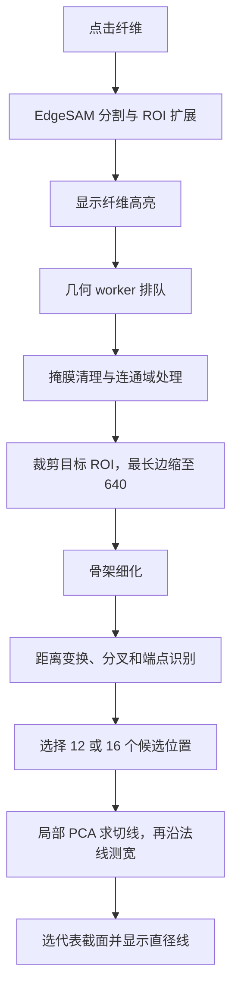

# 快速测径：现状诊断与成熟算法调研

日期：2026-09-15。核对基线：`80b8c3bb3ecf1f8f92401e160f981454c8799b63`，分支 `lard/garment-contour-comparison`。

本报告记录改动前的代码分析、公开资料调研和隔离环境基准。报告中的代码状态与行号对应上述基线；随后授权实施的内容及验证结果见 [首轮实现记录](/Users/lishuyang/PycharmProjects/fiber-diameter-measurement/docs/quick-diameter-implementation-2026-09-15.md)。

## 1. 结论

用户确认的症状是：**纤维区域已经高亮，直径线仍需等待**。应优先处理分割完成后的几何计算。

1. **已确认主要性能瓶颈：本机实际执行纯 Python 骨架细化。** 代码依次尝试 scikit-image、OpenCV contrib，再进入逐像素多轮扫描；前两项在当前项目环境中均不可用，且没有被项目依赖保证。合成样本中，骨架阶段占几何总时间约 97%–99%。
2. **现有算法方向可以保留。** 编译版骨架、局部方向估计、法线截面测宽是一条成熟路线。隔离加入 scikit-image 后，普通样本的几何总耗时从约 0.7–1.2 秒降至约 10–34 毫秒。
3. **必须同时解决正确性。** Python 后备实现的邻域跳变计数存在 NumPy 布尔求和错误；编译版恢复正确骨架后，又暴露出现有交叉区域剔除及候选选线规则的问题。单独安装一个库还不能作为完成修复。
4. **第二阶段适合引入亚像素边缘对测量。** 先用掩膜确定目标和局部方向，再在原始灰度图上定位两侧外边界。项目已有 `SnapService` 可复用，不必从头实现灰度剖面。
5. DiameterJ、GIFT、Steger、Local Thickness 各有成熟依据，但任务定义不同。前两项更适合批量统计和对照验证，不能直接用整幅图的平均直径代替用户当前目标的代表线。

这里的“直径”是显微图像中纤维沿局部法线的投影宽度；它不等同于横截面等效圆直径或整幅纤维网络的平均宽度。

## 2. 当前调用链与开销



### 关键代码证据

| 内容 | 当前行为 | 位置 |
|---|---|---|
| 高亮后提交几何任务 | 分割结果应用到画布后才请求直径计算 | [main_window.py](/Users/lishuyang/PycharmProjects/fiber-diameter-measurement/src/fdm/ui/main_window.py:22728) |
| 后台计算 | 已有 Qt worker、请求编号和过期结果处理 | [fiber_quick_geometry_worker.py](/Users/lishuyang/PycharmProjects/fiber-diameter-measurement/src/fdm/ui/fiber_quick_geometry_worker.py:29) |
| 完整几何流程 | mask 清理、骨架、候选截面、代表线 | [fiber_quick_geometry.py](/Users/lishuyang/PycharmProjects/fiber-diameter-measurement/src/fdm/services/fiber_quick_geometry.py:30) |
| 骨架后端选择 | skimage → ximgproc → Python 循环 | [骨架实现](/Users/lishuyang/PycharmProjects/fiber-diameter-measurement/src/fdm/services/fiber_quick_geometry.py:614) |
| 依赖声明 | 声明 `opencv-python`，没有 scikit-image / opencv-contrib-python | [pyproject.toml](/Users/lishuyang/PycharmProjects/fiber-diameter-measurement/pyproject.toml:13) |
| 全尺寸前处理 | ROI 裁剪前已进行形态学、填孔、连通域、掩膜扫描 | [掩膜前处理](/Users/lishuyang/PycharmProjects/fiber-diameter-measurement/src/fdm/services/fiber_quick_geometry.py:208) |
| 候选位置选择 | 优先取距离变换值较大，即较粗的位置；并非沿整条纤维均匀采样 | [候选选择](/Users/lishuyang/PycharmProjects/fiber-diameter-measurement/src/fdm/services/fiber_quick_geometry.py:275) |
| 超时 | 几何默认 3000 ms；协作式检查，不包含此前分割和排队 | [超时定义](/Users/lishuyang/PycharmProjects/fiber-diameter-measurement/src/fdm/services/fiber_quick_geometry.py:16) |
| 提前确认 | 可取消预览计算，再交给另一个 worker 从掩膜重新测量 | [后台确认任务](/Users/lishuyang/PycharmProjects/fiber-diameter-measurement/src/fdm/ui/main_window.py:27410) |

Python 细化循环受 ROI 面积和细化轮数影响。当前虽然已缩至最长边 640，斜放和弯曲纤维仍有较大的矩形包围区域；多轮遍历会重复访问其中大量背景像素。后台线程可以避免直接在主线程执行，但不会缩短用户等待结果的时间。

次要路径也应记录：快速测径 ROI 最多尝试 3 轮，必要时回退全图；不同 ROI 使用不同编码缓存键，且当前 ONNX 会话固定 CPU。用户本次确认的症状发生在高亮之后，因此这些属于后续端到端分析项。[分割实现](/Users/lishuyang/PycharmProjects/fiber-diameter-measurement/src/fdm/services/prompt_segmentation.py:1325)

## 3. 实测：现有几何流程与成熟骨架实现

### 方法与边界

- 本机 macOS ARM64，Python 3.13.12，NumPy 2.4.3，OpenCV 4.13.0.92；OpenCV 默认线程数 18。
- 基线环境没有 scikit-image，也没有 `cv2.ximgproc.thinning`。
- 使用同一套现有几何代码、6 个合成 mask、预先生成的预览轮廓，每项运行 3 次，报告中位数。
- **表中仅为“已有 mask → 直径线”的几何时间。** 不含模型推理、Qt 排队/绘制、进程启动和库导入。包含轻量分段计时和骨架连通性检查。
- scikit-image 0.26.0 通过 `uv run --no-sync --with` 临时依赖环境加载，未改 `pyproject.toml`、`uv.lock` 或项目虚拟环境。
- OpenCV contrib 已核对官方接口；本次临时依赖下载长时间未完成，已停止该对比，因此不提供它的实测耗时。
- 合成线的绘制厚度不作为亚像素精度真值；它们用于性能和明显几何错误诊断。

| 合成目标 | 原始图尺寸 | 当前 Python 后备，ms | scikit-image，ms |
|---|---:|---:|---:|
| 小矩形 | 160×120 | 71.7 | 1.1 |
| 横向纤维，60 px | 1024×768 | 698.9 | 9.7 |
| 斜向纤维，40 px | 1024×768 | 803.9 | 14.9 |
| 斜向纤维，120 px | 2048×1536 | 1236.2 | 33.8 |
| 弯曲纤维，48 px | 1024×768 | 817.1 | 13.0 |
| 十字交叉 | 220×220 | 347.2 | 5.5，**选线错误** |

普通样本约有 37–72 倍的几何提速空间。这是本机小规模实验结果，不是目标 Windows 机器的承诺，也不是用户真实图像上的精度验收。

### 首次使用成本

本次新建临时环境后，首次导入 scikit-image morphology 的一次观测耗时约 **10.39 秒**，上表将其单独排除。随后在文件缓存已热的情况下，另开 3 个 Python 进程，导入耗时分别为 **527.9 / 537.6 / 531.7 ms**。两种测量均在 NumPy / OpenCV 已导入后计时。

10.39 秒可能受到首次访问动态库和系统缓存等因素影响，尚不能视为稳定常数；后续约 0.53 秒也仍属于用户能感知的延迟。因此必须分别测量首次导入、首次点击和重复测量，并把所选骨架后端的初始化安排在可控时机。原始记录见 [import_timings.json](/Users/lishuyang/PycharmProjects/fiber-diameter-measurement/docs/research/quick-diameter-2026-09-15/import_timings.json)。

### 现有测试

- 当前环境：`tests/test_fiber_quick_geometry.py` **11 passed**。
- 临时 scikit-image 环境：**10 passed，1 failed**；失败项为 `test_avoids_crossing_center_for_cross_mask`。
- 这一失败阻止将“换库即可完成”作为结论；不能为了提速删除交叉纤维测试。

## 4. 同时发现的正确性问题

### 4.1 Python 骨架细化的跳变计数错误，已复现

[现有代码](/Users/lishuyang/PycharmProjects/fiber-diameter-measurement/src/fdm/services/fiber_quick_geometry.py:657) 将多个 NumPy 比较结果先以 `+` 相加，再在最外层转换为 `int`。这些值是 NumPy 布尔标量，相加仍得到布尔值，并没有累计 0→1 跳变次数。

本机最小复现：八邻域循环为 `1,0,1,0,1,0,1,0` 时，正确跳变次数为 **4**，现有表达式得到 **1**。这会让不应删除的像素通过细化条件。

实际骨架观测：

| 掩膜 | 当前后备实现 | scikit-image |
|---|---|---|
| 小矩形 | 2 个孤立骨架点，2 个连通分量 | 13 个骨架点，1 个连通分量 |
| 横向长条 | 2 个孤立骨架点，2 个连通分量 | 578 个骨架点，1 个连通分量 |
| 斜向 40 px 纤维 | 107 个骨架点，95 个连通分量 | 584 个骨架点，1 个连通分量 |

所以，现有测试中“还能量出接近正确的宽度”，不代表骨架正确。局部切线计算在骨架点太少时会退回使用 mask 像素，掩盖了部分骨架问题。

### 4.2 编译版骨架暴露交叉区域选线问题，已复现

十字样本两条臂的像素中心间宽度约为 40 px；直接换成 scikit-image 后，现有后续流程给出了 **180 px** 的纵向/横向长线，并触发已有交叉回归测试失败。

代码中能解释这一现象的机制：

- 分叉只屏蔽固定半径 4 px，未随局部纤维宽度变化。
- 候选点按距离变换值从大到小取样，交叉附近的宽区域容易被优先选中。
- 局部 PCA 窗口半径约为局部半径的 3 倍，可能同时包含两条交叉分支，导致方向估计混杂。

建议将分叉剔除范围与局部半径关联，沿骨架分支限制方向拟合，并按弧长分散取样。具体比例须在真实 mask 上评估，不能直接把某个经验参数认定为通用正确值。

### 4.3 边界搜索上限可能返回假端点，已复现

[边界搜索](/Users/lishuyang/PycharmProjects/fiber-diameter-measurement/src/fdm/services/fiber_quick_geometry.py:537) 每侧最多走 480 步。耗尽步数后仍返回最后一个内部点，没有“尚未找到边界”状态。

直接调用该函数，令搜索方向上的前景范围为 x=100…1299、起点 x=700，得到端点 x=221 和 x=1179，长度 **958 px**，且 `hit_border=False`；两端显然还在前景内部。后续应按 ROI/距离先验确定搜索范围，并明确区分“找到边界”“碰到图像边缘”“搜索耗尽”。这是函数级边界实验，不代表正常窄纤维均受影响。

### 4.4 测量定义和像素误差需要明确

- 当前是在二值 mask 上用整数索引搜索，浮点坐标返回值不等于亚像素边缘精度。轴对齐的 50 像素宽矩形会得到 49 px 的内部像素中心距离。
- 闭运算、开运算、填孔会改变 mask 边缘；用于稳健估计方向的清理掩膜，应与最终测量所依据的边界区分。
- 对候选集求中位数，不能自动消除“先优先挑粗段”带来的抽样偏差。
- 缩放后的 ROI 用于定位，最终端点需回到原图坐标；还应核对 x/y 实际缩放比例、像素中心约定、数字切片视野原点和标定系数。

## 5. 成熟算法与实现选择

### A. 编译版骨架 + 局部法线截面：第一优先级

原理：把分割目标收缩成中心曲线，估计局部切线，在垂直方向寻找两侧边界；排除交叉、端部和不完整截面后，选择稳定代表值。

可用实现：

- [`skimage.morphology.skeletonize`](https://scikit-image.org/docs/stable/api/skimage.morphology.html#skimage.morphology.skeletonize)：二维默认 Zhang 算法，当前代码已预留调用入口。本次已隔离测量。
- [`cv2.ximgproc.thinning`](https://docs.opencv.org/4.13.0/df/d2d/group__ximgproc.html)：OpenCV contrib 提供 Zhang–Suen / Guo–Hall 细化接口；使用 uint8、前景 255 的输入。适合沿用现有 OpenCV 技术栈。

两者都需要重新验证骨架分支、方向与测宽规则。scikit-image 引入额外依赖；OpenCV contrib 则应在正式环境中替换当前 OpenCV 发行包，不能将两个同名 `cv2` 发行包混装。[OpenCV 官方安装说明](https://github.com/opencv/opencv-python#installation-and-usage)

### B. 灰度剖面与亚像素边缘对：推荐的精度升级

原理：确定局部法线后，在一个窄条带中做灰度平均，平滑并计算梯度，找到纤维两侧外边缘，再插值得到亚像素位置。HALCON 的 `measure_pos` / `measure_pairs` 是成熟工业计量参考；其假设是局部边缘近似直线，测量方向近似垂直于边缘。[测量原理](https://www.mvtec.com/doc/halcon/2505/en/measure_pos.html)、[边缘对接口](https://www.mvtec.com/doc/halcon/2505/en/measure_pairs.html)

项目已有可复用实现：

- [SnapService 主流程](/Users/lishuyang/PycharmProjects/fiber-diameter-measurement/src/fdm/services/snap_service.py:44)：ROI 灰度提取、条带剖面、平滑、梯度、极性判断。
- [边缘对选择](/Users/lishuyang/PycharmProjects/fiber-diameter-measurement/src/fdm/services/snap_service.py:376)。
- [亚像素峰值插值](/Users/lishuyang/PycharmProjects/fiber-diameter-measurement/src/fdm/services/snap_service.py:518)。

建议组合：**mask 决定目标身份和边缘搜索窗口，骨架决定方向，原始灰度图决定最终边界。** 对纹理、管腔、亮暗双边缘，要使用掩膜边界先验约束峰值配对，避免将内部纹理当成外边缘。弯曲处需要缩小条带，降低局部直线假设的误差。

HALCON 用作方法和行为参考；调用其商业运行时不是本项目实现这一原理的前提。现有 SnapService 与 HALCON 的精度等价性尚未验证。

### C. 中轴与距离变换：适合快速粗估和统计对照

距离变换给出前景点到背景的距离；位于适当中轴上的点，可用 `2×距离` 近似局部宽度。DiameterJ 使用中心线与欧氏距离图统计纤维直径，并剔除交叉影响。[DiameterJ 算法说明](https://imagej.net/plugins/diameterj)

可用组件：[`skimage.morphology.medial_axis`](https://scikit-image.org/docs/stable/api/skimage.morphology.html#skimage.morphology.medial_axis)、[`cv2.distanceTransform`](https://docs.opencv.org/4.13.0/d7/d1b/group__imgproc__misc.html)。当前代码已经使用距离变换，但骨架细化结果并不必然等同于严格中轴。

适用建议：作为宽度先验、候选筛选和异常检查；最终仍输出实际两侧边界构成的线。交叉、粘连、不对称形状及像素离散会使“2×距离”与沿指定法线的边界间距不同。不能将 EDT 的数值精确性直接解释成真实直径精度。

### D. Steger 脊线检测：有针对性的备选

Steger 1998 方法依据图像导数寻找曲线中心，相关实现提供线位置和宽度估计。适合具有清晰亮线/暗线结构的纤维。尺度参数与纤维宽度有关；强内部纹理和中空纤维可能让检测器响应于纤维壁而非整个纤维。

实现入口：[ImageJ Ridge Detection](https://imagej.net/plugins/ridge-detection)、[ImageJ Ops detectRidges 源码](https://github.com/imagej/imagej-ops/blob/master/src/main/java/net/imagej/ops/segment/detectRidges/DefaultDetectRidges.java)。前者官方页面明确标记为停止维护；后者可作脊线实现参考，其输出与宽度测量接口需要另行核对。暂不建议为本次等待问题先引入整套 Java 运行链路。

### E. GIFT：批量测径的研究参考

GIFT 针对 SEM 纤维图像，使用 Sobel 边缘、百分比阈值、多角度旋转、线形开运算和边缘间距直方图，估计图像中的纤维直径分布。

[原始论文](https://journals.plos.org/plosone/article?id=10.1371/journal.pone.0275528)、[作者实现和数据](https://github.com/IBMTRostock/GIFT)。其结果是统计意义上的分布/均值，不直接解决“点击这根纤维，立即显示一条代表直径线”。适合后续批量功能和离线方法对比；SEM 文献的误差不能直接迁移到本项目的透射显微图像。

### F. Local Thickness / BoneJ：厚度图工具

Local Thickness 在每一点寻找“包含该点且完全位于目标内的最大圆/球”，以其直径作为厚度。它与“以该点为圆心的 EDT 半径”定义不同。[BoneJ 官方说明](https://bonej.org/thickness)

适合形态厚度图和批量结构分析；不天然返回两侧边界端点，大结构计算还可能较慢。本次单条交互测径的优先级较低。

### 方法选择汇总

| 方法 | 输入 | 适合当前交互 | 建议用途 |
|---|---|---|---|
| 编译骨架 + 法线截面 | mask | 高 | 首轮改造，保留现有流程 |
| mask 约束 + 亚像素边缘对 | mask + 原始灰度图 | 高 | 精度与稳定性升级 |
| 中轴 + EDT | mask | 较高 | 粗估、筛选、合理性检查 |
| Steger | 灰度图 + 尺度范围 | 依图像而定 | 脊线特征明确时作对照 |
| DiameterJ / GIFT | 二值图或 SEM 灰度图 | 单次点选适配较低 | 离线基准、批量统计参考 |
| Local Thickness | 二值图 | 较低 | 厚度分布图 |

全局 PCA、最小外接矩形短边、最小 Feret 宽度可辅助判断整体方向或形状，但弯纤维的整体包围宽度不代表其局部直径，不能直接替代上述截面测量。

## 6. 建议实施顺序

### 阶段一：恢复稳定、快速的现有测径

1. 在分割完成到直径出现之间记录排队、mask 前处理、骨架、候选计算、结果投递和绘制时间；同时记录实际骨架后端。
2. 正式确定并锁定一个编译版骨架实现，使开发环境和 Windows 包采用相同算法；检查发行包依赖和首次初始化行为。
3. 同步修正分叉排除、候选采样和局部方向估计，补齐连通性、交叉线宽及搜索耗尽用例。
4. 尽早在目标 ROI 内处理，保留原点与原图尺寸，减少全尺寸 mask 的复制与扫描；复核边缘剔除原有语义。
5. 验证连续点击只展示最新结果；提前确认时尽量复用同一任务结果，减少取消后重算。保留用户已确认任务的完成与记录能力。

完成标准应同时包含速度和正确性，不能只要求测试全绿或响应更快。

### 阶段二：提高边界精度

1. 通过 mask / 骨架得到若干可靠截面及大致边界。
2. 将原始图像或冻结视野快照交给测量服务，在每个外边界附近的小窗口内做灰度剖面定位。
3. 检查边缘强度、极性、配对距离、相邻截面一致性和方向稳定性；结果不可靠时保留可编辑线或明确失败。
4. 记录几何结果和灰度精修结果，评估有符号误差、绝对误差和人工修正率。不要以 mask IoU 代替直径精度。

当前功能的“代表线”语义建议先保留。如希望将其改为“用户点击附近的局部直径”，应另作明确产品决定；它与沿整条纤维取代表值是不同测量口径。

## 7. 验证方案

### 数据

- 合成：不同宽度和方向、平滑弯曲、逐渐变粗、T/X/Y 交叉、粘连、近邻平行、端部、触边、不完整 ROI，以及 >480 px 单侧搜索距离。
- 真实：单根/交叉/中空/纹理强/低对比/失焦样本，保留原图、分割 mask、原图坐标和人工认可的边界对。按样本或视野划分调参集和独立验证集。
- 数字切片：同时保留焦层、视野原点、有效覆盖区域及标定信息。
- 仓库所见 `sample_data/readme-demo/演示图片.jpg` 是软件界面截图，不应把它作为原始显微图或像素精度真值。本次没有用户实际慢样本的 mask，尚未完成真实数据验证。

### 指标

| 维度 | 应报告 |
|---|---|
| 交互延迟 | 从高亮到首条可靠线、从点击到最终结果；分别报告冷启动和重复操作 |
| 性能分布 | 样本量足够后报告 p50 / p95、最大值、超时比例和队列等待 |
| 直径精度 | 像素和物理单位下的有符号误差、绝对误差及长尾 |
| 几何合理性 | 骨架连通性、局部方向、两端是否真到边界、是否穿越交叉 |
| 使用体验 | 无结果率、错误高置信结果率、需要手动修正的比例 |
| 发布一致性 | 目标 Windows 硬件、实际安装包的后端、版本和首次加载 |

可把“高亮后重复测量 p95 ≤100 ms、困难样本 ≤300 ms”作为第一轮工程目标；这些是待验证目标，不是已达成指标。首次点击需另列初始化预算。精度容差应由真实图像分辨率、标定误差和业务要求共同确定。

## 8. 基准材料与复现

基准脚本：[benchmark.py](/Users/lishuyang/PycharmProjects/fiber-diameter-measurement/docs/research/quick-diameter-2026-09-15/benchmark.py)。原始记录：[baseline.json](/Users/lishuyang/PycharmProjects/fiber-diameter-measurement/docs/research/quick-diameter-2026-09-15/baseline.json)、[skimage.json](/Users/lishuyang/PycharmProjects/fiber-diameter-measurement/docs/research/quick-diameter-2026-09-15/skimage.json)。

在仓库根目录运行，输出可放到临时目录：

```bash
uv run --no-sync python -B docs/research/quick-diameter-2026-09-15/benchmark.py --output /tmp/fdm-quick-baseline.json
uv run --no-sync --with scikit-image==0.26.0 python -B docs/research/quick-diameter-2026-09-15/benchmark.py --output /tmp/fdm-quick-skimage.json
QT_QPA_PLATFORM=offscreen uv run --no-sync python -B -m pytest tests/test_fiber_quick_geometry.py -q -p no:cacheprovider
QT_QPA_PLATFORM=offscreen uv run --no-sync --with scikit-image==0.26.0 python -B -m pytest tests/test_fiber_quick_geometry.py -q -p no:cacheprovider
```

基线命令会采用运行环境实际可用的后端，复现前应核对 JSON 中 `backend` 和 `versions`，不能仅依据命令名称认定仍在使用 Python 后备。
