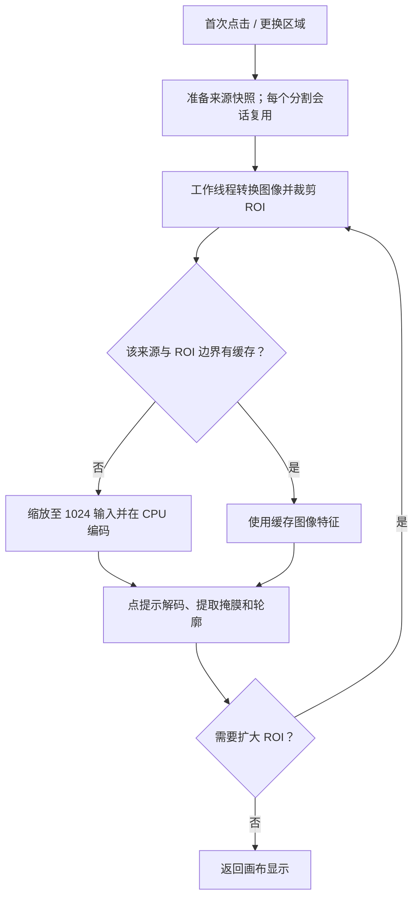

# 魔棒 ROI 局部分割性能分析

日期：2026-09-16。代码基线：`d9a0dd7`。以下保留实施前的分析记录；后续实现、回归和验收结果见[实施报告](/Users/lishuyang/PycharmProjects/fiber-diameter-measurement/docs/research/magic-roi-performance-2026-09-16/IMPLEMENTATION.md)。

## 结论

用户反馈为“每次换一个 ROI 后，首次点击都慢”。当前最直接的原因是：**换区域后无法复用图像特征，必须重新执行一次 CPU 图像编码；小 ROI 仍按 1024×1024 模型输入计算。** 本机实测，新区域单轮耗时 96.3 ms，编码及其图像准备占 83.7 ms（约 87%）；相同区域复用缓存后只需 14.2 ms。

还确认了两个放大因素：

1. 自动 ROI 扩大可使一次点击执行 5 次完整编码；最后的兜底可能重复处理已经计算过的整图。
2. 5 个不同缓存键与最多保留 4 个 ROI 的策略相冲突。已复现第二次相同请求也连续 5 次未命中缓存。

以上解释与用户描述一致；弱配置 Windows 电脑的实际耗时仍需现场计时，不能直接由本机数值换算。

## 测量边界

- 本机：Apple M5 Pro，18 核，macOS 26.6.2 ARM64；ONNX Runtime 1.24.4，OpenCV 4.13.0。
- 使用仓库实际 EdgeSAM / EdgeSAM-3x ONNX 模型；推理后端为代码指定的 `CPUExecutionProvider`。
- 采用可复现的合成圆形目标、贯穿图像的长条目标；没有评估真实样本分割精度。
- 普通魔棒路径，开启 ROI，`local_masks=True`，关闭补孔；不含数字切片覆盖裁剪和剔除小目标增强。
- 表中“单次请求”测量范围为 `PromptSegmentationService.predict_polygon`，不含主窗口来源快照、Qt 排队、画布绘制及完整程序启动。
- 单次操作表是同一服务进程中的顺序样本；ROI 尺寸对照各测 3 次取中位数；线程对照剔除首轮后取 3 次中位数。不同进程结果存在调度差异。
- 另用假预测掩码验证控制流，相关 JSON 明确标记 `synthetic_control_flow_only`；它的耗时不代表模型速度。5 次真实模型调用也已独立复现。

## 一、调用链及第一瓶颈



[主窗口请求入口](/Users/lishuyang/PycharmProjects/fiber-diameter-measurement/src/fdm/ui/main_window.py:22429)获取来源快照后将请求交给[后台 worker](/Users/lishuyang/PycharmProjects/fiber-diameter-measurement/src/fdm/ui/prompt_segmentation_worker.py:68)。模型 session 按变体保留；并非每换一个 ROI 都重新加载模型文件。

[session 初始化](/Users/lishuyang/PycharmProjects/fiber-diameter-measurement/src/fdm/services/prompt_segmentation.py:1665)将编码器、解码器都固定为 CPU；即使机器存在其他硬件推理后端，当前路径也不会选择它们。[默认设置](/Users/lishuyang/PycharmProjects/fiber-diameter-measurement/src/fdm/settings.py:792)为 EdgeSAM-3x。

[编码预处理](/Users/lishuyang/PycharmProjects/fiber-diameter-measurement/src/fdm/services/prompt_segmentation.py:1725)把区域缩放到目标尺寸。实际加载的 EdgeSAM-3x 编码器输入为 `float32 [1,3,1024,1024]`；标准 EdgeSAM 的 ONNX 输入声明允许动态尺寸，但当前应用仍把正方形 ROI 放到 1024×1024 后传入。

### 实测：紧凑目标，EdgeSAM-3x

| 操作 | 总耗时 ms | 编码及准备 ms | 解码及掩膜恢复 ms | 轮廓处理 ms | 编码次数 |
|---|---:|---:|---:|---:|---:|
| 服务首次使用，含 session 初始化 | 184.8 | 165.2 | 14.2 | 4.9 | 1 |
| 相同 ROI、相同点再次请求 | 14.2 | <0.01 | 12.3 | 1.0 | 0 |
| 同 ROI 增加一个不改变裁剪边界的负点 | 12.5 | <0.01 | 10.7 | 1.4 | 0 |
| 更换到另一处 ROI | 96.3 | 83.7 | 11.2 | 1.0 | 1 |
| 原位置附近增加一个偏移 8 px 的正点 | 90.5 | 77.1 | 11.3 | 1.2 | 1 |

首次使用中的 session 初始化占 73.2 ms。这里只计加载 session；Python 导入和整个程序冷启动不在表中。

原始数据：[core-edge_sam_3x.json](/Users/lishuyang/PycharmProjects/fiber-diameter-measurement/docs/research/magic-roi-performance-2026-09-16/results/core-edge_sam_3x.json)。

### 实测：缩小 ROI 没有显著降低编码量

| 原始 ROI | 模型实际收到的张量 | 编码含预处理，中位数 ms |
|---|---|---:|
| 128×128 | 1×3×1024×1024 | 76.9 |
| 256×256 | 1×3×1024×1024 | 75.6 |
| 512×512 | 1×3×1024×1024 | 76.1 |
| 1024×1024 | 1×3×1024×1024 | 79.0 |

ROI 仍可以增加目标在模型输入中的相对尺寸、减少背景干扰和部分后处理开销，但当前实现不能指望模型编码成本随原始裁剪面积等比例下降。

## 二、自动扩大与重复兜底：一次点击最多编码 5 次

[扩大条件](/Users/lishuyang/PycharmProjects/fiber-diameter-measurement/src/fdm/services/prompt_segmentation.py:580)：未得到掩膜、目标接触裁剪框至少两条边，或占裁剪框面积达到 70%。普通模式最多循环 4 轮，最后一轮使用完整约束区域；仍触发扩大条件时，再走一次兜底。

对于 2048×1536 图像中的一条横贯图像的目标，实际调用序列为：

```text
256×256 → 461×461 → 829×829 → 2048×1536 → 2048×1536
```

第 4、5 次的图像和提示点相同，但[兜底逻辑](/Users/lishuyang/PycharmProjects/fiber-diameter-measurement/src/fdm/services/prompt_segmentation.py:1389)额外给缓存键加上 `|fallback`，因此第 5 次重新编码，不能复用第 4 次结果。

真实 EdgeSAM-3x 在合成长条图上的实测：

| 请求 | 总耗时 ms | 编码次数 | 解码次数 | 缓存命中 |
|---|---:|---:|---:|---:|
| 首次，含 session 初始化 | 556.0 | 5 | 5 | 0 |
| 原图原点再次请求 | 472.1 | 5 | 5 | 0 |

第二次请求的模型编码本身占 338.8 ms，编码加准备共 375.5 ms；解码加掩膜恢复 65.5 ms；轮廓处理 26.5 ms。

数据：[elongated-edge_sam_3x.json](/Users/lishuyang/PycharmProjects/fiber-diameter-measurement/docs/research/magic-roi-performance-2026-09-16/results/elongated-edge_sam_3x.json)；控制流独立验证：[schedule-edge_sam_3x.json](/Users/lishuyang/PycharmProjects/fiber-diameter-measurement/docs/research/magic-roi-performance-2026-09-16/results/schedule-edge_sam_3x.json)。

### 缓存为什么第二次仍然全部失效

[缓存淘汰逻辑](/Users/lishuyang/PycharmProjects/fiber-diameter-measurement/src/fdm/services/prompt_segmentation.py:1693)最多保存 4 个带 `|roi=` 的键，而上述调用产生 5 个键。第二次从第一个小 ROI 开始计算时，会逐项淘汰之后仍要使用的缓存；同样的顺序反复执行，可能持续全部未命中。

此外，[ROI 中心取最后一个正点](/Users/lishuyang/PycharmProjects/fiber-diameter-measurement/src/fdm/services/prompt_segmentation.py:1294)，键包含精确裁剪坐标。即使仍在同一物体上，只移动 8 px 再补正点，也会得到新裁剪框，重跑编码。当前“缓存复用”的条件是边界完全相同，并非物体相同或 ROI 大量重叠。

## 三、其他开销与已排除的误判

### 主线程来源快照与整图转换

[图像版本计算](/Users/lishuyang/PycharmProjects/fiber-diameter-measurement/src/fdm/services/segmentation_source.py:16)转换 RGBA 并做全图 SHA-256；[来源快照建立](/Users/lishuyang/PycharmProjects/fiber-diameter-measurement/src/fdm/ui/main_window.py:22359)发生在主窗口的同步请求路径。它会在同一分割会话中复用，不能算作每次补点的开销。

[每次预测](/Users/lishuyang/PycharmProjects/fiber-diameter-measurement/src/fdm/services/prompt_segmentation.py:1250)则先转整张 QImage 为 RGB 数组，再裁剪，再查 embedding 缓存。普通大图即使最终只用一个小 ROI，也存在整图内存读写。

| 原图大小 | 版本哈希，中位数 ms | 全图 RGB 转换复制，中位数 ms |
|---|---:|---:|
| 2048×1536 | 4.0 | 0.34 |
| 6000×4000 | 34.3 | 5.50 |

数据：[source-edge_sam_3x.json](/Users/lishuyang/PycharmProjects/fiber-diameter-measurement/docs/research/magic-roi-performance-2026-09-16/results/source-edge_sam_3x.json)。这些是本机的次要开销；更大图片与低内存带宽机器需要重新测量。

### 几何和界面

- 普通自动 ROI 每轮会提取两次几何：裁剪结果内一次，转换到来源坐标后一次。有合并空间；上述紧凑目标中合计约 1 ms，并非该样例的主要等待来源。
- 当前普通魔棒 worker 已使用 `MaskRegion` 局部掩膜，不能把这条路径误判为每轮都构造原图大小的掩膜。
- [画布补点](/Users/lishuyang/PycharmProjects/fiber-diameter-measurement/src/fdm/ui/canvas.py:4724)在忙碌期间合并待处理请求，完成后再提交最新提示；不是每次点击都无限追加一个模型任务。但进行中的推理仍会使最新请求等待。
- 数字切片覆盖裁剪、补孔及剔除小目标增强是附加分支，本次用户描述没有指向它们，未用这些分支的数据推断主要瓶颈。
- 本轮没有测量完整 GUI 帧时序，因此不宣称已经排除所有界面耗时。

### 线程参数不是已证实的根因

当前未显式设置 ONNX Runtime 线程数。[官方线程文档](https://onnxruntime.ai/docs/performance/tune-performance/threading.html)说明默认值会按物理核建立线程池，线程数和等待策略需要根据负载调节。

本机 EdgeSAM-3x“新编码 + 解码恢复”的中位数：默认 87.2 ms、1 线程 189.7 ms、2 线程 153.3 ms、4 线程 105.4 ms、8 线程 86.7 ms。这里的少线程设置不等于模拟旧款 Windows CPU，且不能支持“统一改成 2 线程更快”的结论。

数据：[threads-edge_sam_3x.json](/Users/lishuyang/PycharmProjects/fiber-diameter-measurement/docs/research/magic-roi-performance-2026-09-16/results/threads-edge_sam_3x.json)。

### EdgeSAM-3x 不表示推理量增加三倍

[EdgeSAM 官方说明](https://github.com/chongzhou96/EdgeSAM#overview)中，3x 表示使用更多训练数据，表列结构计算量相同。本仓库实际模型比较：标准 EdgeSAM 的 256×256 ROI 编码含准备为 111.9 ms，3x 为 75.6 ms；导出格式也不同。不能根据名字直接换成标准版并承诺更快。

数据：[core-edge_sam.json](/Users/lishuyang/PycharmProjects/fiber-diameter-measurement/docs/research/magic-roi-performance-2026-09-16/results/core-edge_sam.json)。

## 四、建议优化顺序

### 第一批：去除已经确认的重复工作

1. 已对完整约束区域完成推理后，直接复用结果，避免再用 `|fallback` 重跑相同输入。失败结果也应避免原样重复推理。
2. 采用稳定的 ROI 工作区；新提示仍适合当前边界时复用同一 embedding，需要扩展时再编码。保留来源版本、焦面、坐标与边界校验，不能直接把不同裁剪图当作同一图像特征。
3. 保留当前会话各轮必要缓存，按内存预算淘汰；消除“5 个键循环访问、只留 4 个”的情况。复用上一轮已经可用的较大区域，减少每次又从最小框开始扩大。
4. 补充按请求关联的分段计时：来源快照、排队、缓存命中、各轮编码、解码、几何、主线程接收和显示。现有 `Magic segmentation preprocess` 日志包含编码及首次 session 加载，却没有请求标识、各阶段和完整显示耗时。

这些变化主要帮助重复扩框、邻近区域和连续补点；**完全陌生且没有提前计算过的区域，仍需支付一次编码成本**。仅扩大缓存不能消除这部分等待。

### 第二批：降低首次点击感知与 CPU 成本

- 在用户进入工具后异步预热 session；它仅改善首次使用模型的冷启动，不解决每个新 ROI 的编码。
- 评估有内存与 CPU 预算的固定区域预计算，提前准备当前可见或即将交互区域的 embedding；必须避免后台任务反过来争用前台 CPU。
- 将整图 RGB 转换与来源版本复用到图像版本级别；精简重复轮廓处理。保留图像编辑后的正确失效规则。
- 如果一次编码在目标机器上仍然太慢，再评估适配 CPU 的模型导出或量化、低分辨率模型以及可选硬件后端。当前 3x 模型输入固定为 1024，单改 `target_length=512` 不会生效；需要验证编码器、解码器、坐标缩放及真实样本边界精度。

### 打包与验收边界

已检查 [Windows 模型资源检查](/Users/lishuyang/PycharmProjects/fiber-diameter-measurement/scripts/build_windows_onedir.py:61)及 [PyInstaller ONNX Runtime 收集](/Users/lishuyang/PycharmProjects/fiber-diameter-measurement/packaging/pyinstaller/fdm_onedir.spec:86)。现有打包路径包含这两组 ONNX 资源及 ONNX Runtime 依赖；业务代码选择 CPU 的行为在打包后仍然成立。以上属于源码检查，不是打包产物运行验收。

第一批优化可以保留现有模型与依赖。后续若改模型格式或硬件后端，需要同时更新模型资源、运行时动态库与打包产物自检，并保留 CPU 回退。验收应使用性能一般的 Windows 机器及实际打包程序，分别测冷启动、新 ROI、同 ROI 补点、触边扩框的 P50/P95 延迟与真实样本结果。

## 五、复现

分析脚本：[benchmark.py](/Users/lishuyang/PycharmProjects/fiber-diameter-measurement/docs/research/magic-roi-performance-2026-09-16/benchmark.py)。它只在独立进程中添加计时包装，禁用该进程的性能日志写入，不修改应用或用户设置。默认结果写入脚本旁的 `local-runs`；归档数据保留在 `results`。

从仓库根目录使用现有 uv 环境：

```sh
uv run --no-sync python docs/research/magic-roi-performance-2026-09-16/benchmark.py --mode core --variant edge_sam_3x
uv run --no-sync python docs/research/magic-roi-performance-2026-09-16/benchmark.py --mode core --variant edge_sam
uv run --no-sync python docs/research/magic-roi-performance-2026-09-16/benchmark.py --mode elongated
uv run --no-sync python docs/research/magic-roi-performance-2026-09-16/benchmark.py --mode schedule
uv run --no-sync python docs/research/magic-roi-performance-2026-09-16/benchmark.py --mode threads
uv run --no-sync python docs/research/magic-roi-performance-2026-09-16/benchmark.py --mode source
```

各模式顺序运行，避免基准之间争抢 CPU。`schedule` 使用假模型，只核查调用次数；`core`、`elongated`、`threads` 使用实际 ONNX。JSON 内的 `embedding_inclusive` 包含模型编码和首次 session 初始化，`decoder_and_postprocess` 包含解码器推理；这些嵌套阶段不能再次与它们的子阶段相加。
