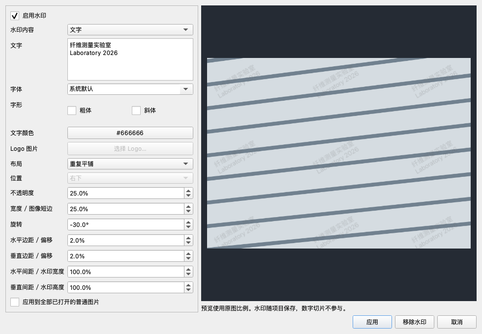
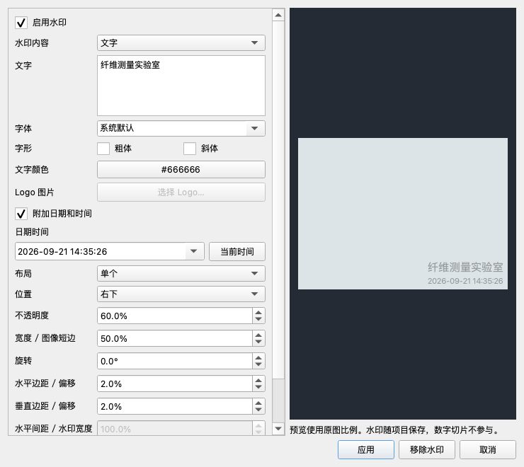

# 普通图片水印：开发验证记录

日期：2026-09-21。基于 `0d09fb2a1b8586d43fffa6deff9f776bccf112b8` 的本轮工作区实现。

## 验证环境与结论

- Apple M5 Pro，macOS 27.0 arm64，Python 3.13.12，Qt / PySide6 6.10.2。
- Qt 使用 offscreen 平台；测试图像由程序生成。
- 普通图片的文字、Logo、水印布局、导出、历史记录、项目资产与数字切片隔离通过本机开发验证。
- Windows 打包结果、安装后的行为和真实显微图片交互体验尚未实机验收。

## 功能回归

| 验证组 | 结果 | 记录 |
|---|---|---|
| 画布、全部数字切片测试、历史、项目保存、导出、快速测径、魔棒、数据集和发布自检 | 1,189 项 + 234 子测试通过 | [完整回归](validation/watermark-2026-09-21/regression.log) |
| 后续重绘与资源修复：水印、画布局部刷新、全部数字切片测试、项目资产及导出控制器 | 513 项 + 8 子测试通过 | [修复回归](validation/watermark-2026-09-21/canvas-asset-regression.log) |
| 最终水印、Windows 构建门禁与安装脚本、发布自检 | 111 项 + 35 子测试通过 | [最终专项](validation/watermark-2026-09-21/package-gate-tests.log) |

各组有重叠，不能把数量相加作为独立测试总数。

水印专项覆盖：

- 中文、多行文字、PNG/JPEG/WebP 解码，透明 Logo 在 0%、25%、100% 不透明度下的合成。
- 单个 / 平铺、旋转、边缘裁剪；DPR 1、1.5、2 以及缩放后的视窗与整图裁剪一致。Qt 旋转纹理采样允许单个颜色通道最多 1/255 的舍入差异。
- 平移复用 Logo 解码和水印块；Logo 超过缓存预算时，仍复用小水印块而不逐帧解码；按字节淘汰缓存；大倍率下直接裁剪绘制，避免分配超大透明蒙层。
- 对象拖动时恢复水印背景，精确叠加缓存失效；没有测量对象的画布也能在应用、撤销和补回 Logo 后立即刷新。
- 取消不修改文档，批量作为一组撤销 / 重做，数字切片自动跳过。
- 项目重开、另存为、项目和资源目录一起迁移、哈希去重、删除外部 Logo 原文件、历史资源恢复、JSON 提交失败回滚。
- 缺失 Logo 保留配置并阻止包含水印的导出；可以改用文字水印恢复保存。
- 模拟不支持 `image-watermark/v1` 的读取器，确认项目只读并阻止覆盖原文件。
- 原图、16 位 / 浮点 TIFF 原始像素导出、魔棒来源缓存、测量几何不变；处理生成的派生图片不继承水印。
- 数字切片入口禁用、混合批量跳过；强制提供水印配置时，两个焦面的原始视窗导出仍逐像素保持一致。既有预览等待、缩放、标注和缓存交接测试一并执行。

### 复现命令

```sh
QT_QPA_PLATFORM=offscreen uv run --no-sync pytest -q \
  tests/test_watermark.py tests/test_digital_slide*.py \
  tests/test_ui_canvas_and_export.py tests/test_canvas_render_pipeline.py \
  tests/test_canvas_overlay_cache.py tests/test_canvas_overlay_handoff.py \
  tests/test_canvas_interaction_invalidation.py tests/test_canvas_progressive_overlay.py \
  tests/test_magic_roi_performance.py tests/test_fiber_quick_geometry.py \
  tests/test_main_window_image_processing.py tests/test_dataset_export.py \
  tests/test_overlay_render_self_check.py tests/test_build_windows_onedir.py \
  tests/test_release_self_check.py tests/test_models_project_io.py \
  tests/test_history_and_sidecar.py tests/test_history_state_stamps.py \
  tests/test_project_export_controllers.py tests/test_export_options_dialog.py \
  tests/test_raster_export.py tests/test_project_analysis_asset_save.py \
  tests/test_export_service.py

QT_QPA_PLATFORM=offscreen uv run --no-sync pytest -q \
  tests/test_watermark.py tests/test_canvas_interaction_invalidation.py \
  tests/test_canvas_progressive_overlay.py tests/test_digital_slide*.py \
  tests/test_project_analysis_asset_save.py tests/test_project_export_controllers.py

QT_QPA_PLATFORM=offscreen uv run --no-sync pytest -q \
  tests/test_watermark.py tests/test_build_windows_installer.py \
  tests/test_build_windows_onedir.py tests/test_release_self_check.py
```

第一组完成后补充了重绘、缺失资源切换和迁移 / 兼容性用例，后续组验证最终版本；重新运行第一组会包含新增测试。

## 性能对照

命令：

```sh
uv run --no-sync python scripts/benchmark_watermark.py \
  --iterations 60 --output .tmp/watermark/benchmark.json
```

每个场景分别关闭和开启水印，预热 12 次，再测量 60 次；关闭水印为同机基线。输出为 1280×800 视窗的 Qt CPU 绘制耗时，包含底图。缩放循环使用四个倍率，平移改变视窗位置。它不包含桌面合成器、输入事件、图像加载或 Windows 包启动时间。

单位：毫秒。完整原始记录见 [benchmark-macos.json](validation/watermark-2026-09-21/benchmark-macos.json)。

| 原图 | 内容 / 布局 | 操作 | 关闭水印 P50 / P95 | 开启水印 P50 / P95 | 缓存峰值 MiB |
|---|---|---|---|---|---|
| 4K | 文字 / 单个 | 平移 | 0.216 / 0.265 | 0.257 / 0.351 | 0.058 |
| 4K | 文字 / 单个 | 缩放 | 0.319 / 0.443 | 0.381 / 0.499 | 0.308 |
| 4K | 文字 / 平铺 | 平移 | 0.197 / 0.240 | 0.559 / 0.656 | 0.273 |
| 4K | 文字 / 平铺 | 缩放 | 0.270 / 0.399 | 0.806 / 1.055 | 1.466 |
| 4K | Logo / 单个 | 平移 | 0.191 / 0.251 | 0.246 / 0.285 | 0.133 |
| 4K | Logo / 单个 | 缩放 | 0.296 / 0.412 | 0.356 / 0.458 | 0.467 |
| 4K | Logo / 平铺 | 平移 | 0.189 / 0.232 | 0.563 / 0.650 | 0.424 |
| 4K | Logo / 平铺 | 缩放 | 0.293 / 0.390 | 0.807 / 1.050 | 2.035 |
| 8K | 文字 / 单个 | 平移 | 0.256 / 0.366 | 0.334 / 0.488 | 0.058 |
| 8K | 文字 / 单个 | 缩放 | 0.429 / 0.614 | 0.487 / 0.635 | 0.308 |
| 8K | 文字 / 平铺 | 平移 | 0.242 / 0.316 | 0.677 / 0.790 | 0.273 |
| 8K | 文字 / 平铺 | 缩放 | 0.451 / 0.575 | 0.983 / 1.233 | 1.466 |
| 8K | Logo / 单个 | 平移 | 0.246 / 0.290 | 0.304 / 0.399 | 0.133 |
| 8K | Logo / 单个 | 缩放 | 0.411 / 0.592 | 0.490 / 0.625 | 0.467 |
| 8K | Logo / 平铺 | 平移 | 0.266 / 0.364 | 0.725 / 0.927 | 0.424 |
| 8K | Logo / 平铺 | 缩放 | 0.449 / 0.627 | 1.056 / 1.266 | 2.035 |

4K 为 3840×2160，8K 为 7680×4320。所有场景在预热后的缓存增长均为 0 字节；每个 Logo 场景只解码 1 次。原图 QImage 的版本标识在测试前后保持一致。全局水印缓存上限为 32 MiB，实测最高约 2.04 MiB。

测试进程峰值 RSS 约 278.1 MiB，包含 8K 原图、Qt 及解释器等，不能视作水印额外内存。缓存稳定结论限于上述重复交互；大尺寸 Logo、复杂字体与目标电脑仍应按实际素材复测。

## 自检与打包

```sh
uv run --no-sync python -m fdm.ui.watermark_self_check
```

本机生产渲染器的 16 项探针全部通过：[renderer-self-check.json](validation/watermark-2026-09-21/renderer-self-check.json)。包括三个图片格式的真实编解码、中文多行文字、透明通道只合成一次、重复平铺、缓存命中和数字切片排除；绘制覆盖 DPR 1、1.5、2。

已接入程序 `--self-check --json` 的 `functional_checks.watermark_renderer`。Windows onedir 构建门禁要求上述检查全部通过；缺失或失败时返回构建自检错误。测试覆盖真实渲染探针和模拟的 Windows 自检 JSON，保留原有快速测径、画布和魔棒门禁。未生成或宣称验证 Windows 安装包。

Windows 实机待验收项：

- 使用正式构建脚本打包，运行包内 `--self-check --json`，保存完整报告。
- 安装后验证中文字体、PNG/JPEG/WebP 导入和中文路径。
- 实际项目迁移、另存为、缺失 Logo 提示及保存失败行为。
- 4K / 8K 图片缩放、平移、对象拖动及包含水印的导出。
- 数字切片混合批量、焦面切换、预览等待及视窗导出。

## 窗口检查

已检查 980×680 和受屏幕限制的较窄窗口；参数区域可滚动，预览与应用 / 取消按钮可见。系统字体显示为“系统默认”，避免字体别名使下拉框误显示列表第一项。

下面使用合成图片展示旋转平铺效果：



## 日期时间附注追加验证（2026-09-21）

在 `340abd8` 基础上增加默认关闭的“附加日期和时间”，对文字和 Logo 使用同一日期时间附注。默认记录勾选时的本机时间，可编辑或用“当前时间”更新；保存、撤销重做和冻结的导出计划均保留具体值。日期时间放在内容下方，原文字与 Logo 的尺寸比例保持不变。

- 相关回归 **711 项 + 51 子测试通过**：[回归日志](validation/watermark-datetime-2026-09-21/regression.log)。包括全部数字切片测试、画布局部刷新、水印、魔棒、模型、历史状态、导出和发布自检。
- 最终水印及发布 / 构建门禁专项 **111 项 + 21 子测试通过**：[专项日志](validation/watermark-datetime-2026-09-21/package-tests.log)。上述测试组有重叠。
- 生产渲染自检 **22 项全部通过**：[JSON](validation/watermark-datetime-2026-09-21/renderer-self-check.json)。新增文字与 Logo 日期时间在 DPR 1、1.5、2 下的绘制与重复结果一致性检查；Windows 构建门禁同步要求这些检查通过。
- 验证了新增日期不会改动主体尺寸或重复应用不透明度，视窗裁剪和平铺相位一致；修改日期使缓存失效，固定日期的重复绘制命中缓存。
- 验证了默认关闭、手动日期编辑、取消、重新打开设置、关闭后再次启用、批量撤销重做、项目重开、冻结导出及旧读取器的只读保护。
- 740×660 窗口下长行自动换行，无横向溢出；纵向参数区域可滚动。

本次为同一 macOS 开发环境验证，Windows 打包和安装后实机验收仍待进行。复现：

```sh
QT_QPA_PLATFORM=offscreen uv run --no-sync pytest -q \
  tests/test_watermark.py tests/test_digital_slide*.py \
  tests/test_canvas_interaction_invalidation.py tests/test_canvas_progressive_overlay.py \
  tests/test_build_windows_onedir.py tests/test_release_self_check.py \
  tests/test_magic_roi_performance.py tests/test_models_project_io.py \
  tests/test_history_state_stamps.py tests/test_export_service.py

QT_QPA_PLATFORM=offscreen uv run --no-sync pytest -q \
  tests/test_watermark.py tests/test_release_self_check.py tests/test_build_windows_onedir.py

uv run --no-sync python -m fdm.ui.watermark_self_check
```


